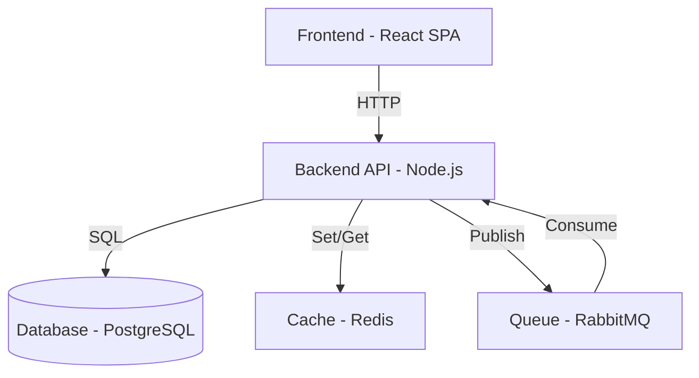
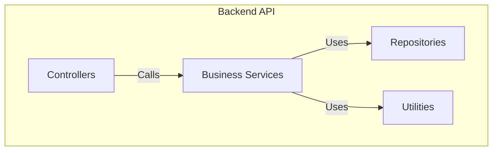

# Architecture Diagram - Interview Guide

## Table of Contents

1. [Objective](#objective)
2. [Block 1: Preparation & Context](#block-1-preparation--context-5-minutes)
3. [Block 2: Deployment Decision](#block-2-deployment-decision-10-minutes)
4. [Block 3: Architectural Patterns Proposal](#block-3-architectural-patterns-proposal-10-minutes)
5. [Block 4: Specific Stack Decisions](#block-4-specific-stack-decisions-10-minutes)
6. [Block 5: C4 Diagram Generation](#block-5-c4-diagram-generation-15-minutes)
7. [Block 6: Patterns & Validation](#block-6-patterns--validation-10-minutes)
8. [Conversational Interaction Guide](#conversational-interaction-guide)
9. [Expected Timeline](#expected-timeline)
10. [Skill Checklist](#checklist-for-the-skill)

---

## Objective

This guide structures questions and interactions to generate the architecture-diagram.md document in an interactive, conversational, and iterative manner.

It follows 6 thematic blocks, each with specific questions, response patterns, and context.

---

## Block 1: Preparation & Context (5 minutes)

### Objective

Read and understand the requirements from the PRD and user-stories before proposing architecture.

### Questions

1. **"I'll review the PRD and user-stories you've already created. Let me confirm I understood correctly..."**
   - List 3-5 main requirements from the PRD
   - Confirm primary personas/actors
   - Confirm non-functional requirements (scale, latency, uptime)

2. **"What is the expected user base in the first year?"**
   - Expected response: number of users, requests per second, data volume
   - Use to estimate scale

3. **"Are there specific availability or latency requirements?"**
   - Response: uptime target (99%, 99.9%, 99.99%), maximum latency (ms)
   - Use to justify HA architecture, caching, etc.

### Confirmation Pattern
```
"So, summarizing:
- [PRD Summary]
- User base: [number]
- Target latency: [ms]
- Uptime: [%]

Is that correct?"
```

### Next Step
If confirmed → Block 2. If not → Clarify.

---

## Block 2: Deployment Decision (10 minutes)

### Objective

Understand infrastructure and hosting constraints.

### Questions

1. **"Do you prefer cloud architecture (AWS, Azure, GCP) or self-hosted (own server/VPS)?"**
   - Expected response: cloud / on-premise / hybrid
   - If cloud: which provider preferred?
   - If on-premise: what infrastructure available?

2. **"Are there geographic region or data residency requirements?"**
   - Response: specific regions, compliance (GDPR, LGPD, etc.)
   - Use to decide multi-region strategy

3. **"What is the estimated budget for infrastructure per month?"**
   - Response: cost range (R$ 1k, 5k, 10k, 50k+)
   - Influences choice of managed services vs self-managed

4. **"Does the team have operational experience with Kubernetes, Docker, CI/CD?"**
   - Response: yes/no/partial
   - Influences architecture complexity

### Response Pattern

Synthesize:
```
"So the plan is:
- Deployment in [cloud/on-premise]
- Regions: [list]
- Budget: ~[amount]
- Team capacity: [level]

With that, I can propose patterns that make sense. Moving to the next step."
```

### Next Step
→ Block 3

---

## Block 3: Architectural Patterns Proposal (10 minutes)

### Objective

Present 2-3 architectural patterns with clear trade-offs. User chooses.

### Patterns to Present

#### Pattern 1: Monolith (applicable for MVP/startups)
```
Name: Monolithic Architecture

Description:
- Single codebase (backend)
- Decoupled frontend (SPA)
- Single database (relational)

Stack: Node.js + Express | Python + Django | Ruby on Rails

When to use:
- Small team (<5 devs)
- MVP or early phase
- Relatively simple business logic
- Simplified deployment

Pros:
+ Easy to understand and quickly onboard new developers
+ Simplified deployment (one codebase)
+ Direct debugging (single process)
+ Performance OK for medium scale

Cons:
- Limited horizontal scalability (stateful)
- Deploying one feature requires full redeploy
- Testing can become complex with growth
- One bug can bring down entire system

Scale: ~10-100K users before becoming critical
Latency: 100-500ms with 1-5 instances
```

#### Pattern 2: Microservices (applicable for scale/large teams)
```
Name: Microservices Architecture

Description:
- Multiple independent services (ex: users, orders, payments)
- Each service has own database
- Message queue for asynchronous communication
- API Gateway for routing

Stack: Node.js + Express + RabbitMQ/Kafka | Python + FastAPI | Go + Gin

When to use:
- Medium-to-large team (5-20+ devs)
- Multiple independent domains/features
- Predictable scale
- Need for independent deployment

Pros:
+ Horizontal scalability (each service scales independently)
+ Decoupled deployment (one service doesn't affect others)
+ Resilience (service failure doesn't bring down system)
+ Teams can work in parallel
+ Heterogeneous stack (each service chooses best tech)

Cons:
- Operational complexity increases (multiple deployments, monitoring)
- Distributed transactions are difficult
- Latency can increase (network hops)
- DevOps/SRE expertise necessary
- Distributed testing is complex

Scale: 100K-10M+ users
Latency: 200-1000ms (with multiple hops)
```

#### Pattern 3: Serverless (applicable for variable workloads)
```
Name: Serverless Architecture

Description:
- Functions-as-a-Service (AWS Lambda, Google Cloud Functions)
- Managed databases (Firebase, DynamoDB, Firestore)
- Event-driven (HTTP, queues, schedules)
- Zero infrastructure management

Stack: AWS Lambda + API Gateway + DynamoDB | Google Cloud Functions + Firestore

When to use:
- Variable workload (peaks and valleys)
- Want to avoid managing servers
- Low budget (pay-as-you-go)
- Fast MVP (low operational overhead)

Pros:
+ Zero infrastructure management
+ Automatic scalability (function scales itself)
+ Pay-as-you-go (low cost at low demand)
+ Fast deployment (function by function)
+ Ideal for MVPs and POCs

Cons:
- Cold start latency (first invoke is slow)
- Vendor lock-in (AWS, Google, etc.)
- Debugging more difficult
- Cost can explode at high continuous demand
- Difficult for stateful operations

Scale: 100-100K users (with variation)
Latency: 1-5s (with cold start), 200-500ms (warm)
```

### Presentation Pattern

```
"Based on requirements, here are 3 options:

1. **Monolith** - Simple, fast to implement, good for MVP
   Recommended if: small team, simple logic

2. **Microservices** - Scalable, complex, recommended at scale
   Recommended if: medium team, multiple domains

3. **Serverless** - No server management, pay-as-you-go
   Recommended if: variable workload, want fast MVP

Which of these makes more sense for your case?
Or want me to detail any further?"
```

### Next Step
User chooses pattern → Block 4

---

## Block 4: Specific Stack Decisions (10 minutes)

### Objective

For chosen pattern, decide specific technologies with justifications.

### Stack Categories

#### Frontend
- **Web:** React, Vue, Svelte, Next.js, etc.
- **Mobile:** React Native, Flutter, Swift, Kotlin, etc.

Question: "Need web, mobile, or both?"
Criterion: PRD requirements (which interaction channels?)

#### Backend
- **Runtime:** Node.js, Python, Go, Java, Ruby, C#, etc.
- **Framework:** Express, Django/FastAPI, Gin, Spring, Rails, ASP.NET, etc.
- **Async:** Bull, Celery, std::async, etc.

Question: "Language preference? Any that the team masters?"
Criterion: team experience, performance required

#### Primary Database
- **Relational:** PostgreSQL, MySQL, MariaDB
- **NoSQL:** MongoDB, DynamoDB, Firestore, Cassandra

Question: "Is data structured or semi-structured?"
Criterion: schema rigidity, query types, consistency

#### Cache
- **Redis, Memcached**

Question: "Need cache for performance?"
Criterion: target latency, access patterns

#### Message Queue (if async)
- **RabbitMQ, Kafka, SQS, Pub/Sub**

Question: "Will use async jobs or event-driven?"
Criterion: volume, durability, latency

#### Hosting
- **Managed:** Heroku, Vercel, Firebase, AWS Elastic Beanstalk
- **Containers:** AWS ECS, Kubernetes (self-hosted or managed)
- **Bare Metal:** AWS EC2, Linode VPS, Hetzner

Question: "Prefer managed (simple) or containers (control)?"
Criterion: operational complexity, cost, control

### Decision Pattern

For each choice:
```
Frontend: [Technology] because [reason]
- Stack: React 19 (JavaScript, large community)
- Reasoning: aligns with team experience, mature library, rich ecosystem

Backend: [Technology] because [reason]
- Stack: Node.js + Express 4.x (shared JavaScript with frontend)
- Reasoning: leverage JS in full-stack, team familiar, fast to develop

Database: [Technology] because [reason]
- Stack: PostgreSQL 16 (relational, open-source, powerful)
- Reasoning: structured data, complex queries OK, ACID compliance

Cache: [Technology] because [reason]
- Stack: Redis 7 (in-memory, fast)
- Reasoning: low latency, supports multiple patterns (cache, sessions, queues)

Queue: [Technology] because [reason]
- Stack: RabbitMQ 3.13 (robust message broker)
- Reasoning: durability, supports complex routing, good monitoring

Hosting: [Technology] because [reason]
- Stack: AWS EC2 + RDS (managed + self-managed)
- Reasoning: scalability, flexibility, team familiar with AWS
```

### Next Step
→ Block 5

---

## Block 5: C4 Diagram Generation (15 minutes)

### Objective

Generate C4 Context, Container, Component diagrams in Mermaid.

### C4 Level 1: Context

Question: "Who are the main actors and external systems?"

Output:
```mermaid
graph TB
    [User/Admin] -->|uses| [System]
    [System] -->|integrates| [External API 1]
    [System] -->|integrates| [External API 2]
```

Description: 1-2 lines per actor and external system

### C4 Level 2: Container

Question: "What is the deployment topology? How many containers/main processes?"

Output:


Description: 1 line per container (name, technology)

### C4 Level 3: Component (if microservices)

Question: "What are the main components/modules within the backend?"

Output:


Description: 1 line per component

### Presentation Pattern

```
"I'll describe the architecture in 3 levels of detail:

Level 1 - Context (30,000 feet view):
[Diagram and description]

Level 2 - Containers (deployment view):
[Diagram and description]

Level 3 - Components (internal view, if applicable):
[Diagram and description]

Does that make sense?"
```

### Next Step
→ Block 6

---

## Block 6: Patterns & Validation (10 minutes)

### Objective

Document architectural pattern decisions and validate overall understanding.

### Patterns to Document

1. **Main Pattern**
   - Decision: [Monolith | Microservices | Serverless]
   - Why: [2-3 technical reasons]
   - Trade-offs: [pros and cons]

2. **Data Pattern**
   - Decision: [Relational | NoSQL | Hybrid]
   - Why: [based on data type, queries]

3. **Communication Pattern**
   - Decision: [Synchronous (REST/gRPC) | Asynchronous (events)]
   - Why: [based on latency, coupling]

4. **Authentication & Authorization**
   - Decision: [OAuth2 | JWT | Custom]
   - Why: [security requirements, user base]

### Validation Questions

```
"Let me confirm I understood everything correctly:

1. Main pattern is [pattern] because [reason]?
2. Data is [type] to support [use cases]?
3. Communication is [sync/async] because [reason]?
4. Authentication uses [method] for [requirement]?

Does anyone want to comment or adjust before generating the final document?"
```

### Completeness Checklist

Before marking as ready:
- [ ] C4 Context diagram shows actors and external systems?
- [ ] C4 Container diagram shows deployment topology?
- [ ] C4 Component diagram (if applicable) shows modularization?
- [ ] Technology stack is clear (frontend, backend, data, cache, queue, hosting)?
- [ ] Pattern decisions are documented with justifications?
- [ ] Diagram aligns with PRD requirements?
- [ ] User confirmed satisfaction?

### Next Step
If YES on all → Generate final document
If NO → Go back to relevant block to adjust

---

## Conversational Interaction Guide

### Tone and Approach

- **Educational:** Explain why each pattern exists
- **Dialogal:** Ask questions, don't assume answers
- **Iterative:** Willingness to revise
- **Practical:** Use real examples, not abstractions
- **Documenter:** Synthesize responses into clear decisions

### Expected Response Pattern

User can respond in various ways:
```
"Let's go with Node.js because the team knows it"
"Need to scale to 100K users"
"Don't have budget for Kubernetes"
"GDPR compliance is critical"
```

Always synthesize:
```
"Great, I noted:
- Language: [Node.js]
- Reason: [team expertise]

This influences the choice of [pattern/stack]. Do you agree with [reasoning]?"
```

### Uncertainty Handling

If user doesn't know the answer:
```
"No problem if you don't know the answer now.
I'll recommend [default option] that works well for [your case].
You can adjust it later."
```

### Change Handling

If user wants to change their mind:
```
"No problem, let's review.
If instead of [option A], we use [option B], this changes:
- [impact 1]
- [impact 2]
- [impact 3]

Does it make sense to keep [option B]?"
```

---

## Expected Timeline

| Block                          | Time | Activity                |
|--------------------------------|------|-------------------------|
| 1. Preparation & Context       | 5 min | Reading + confirmation  |
| 2. Deployment Decision         | 10 min| Infrastructure questions |
| 3. Patterns Proposal           | 10 min| Present 2-3 options     |
| 4. Specific Stack              | 10 min| Choose technologies     |
| 5. C4 Diagrams                 | 15 min| Generate Mermaid C4     |
| 6. Patterns & Validation       | 10 min| Document decisions      |
|                                |       |                          |
| **Total**                      | **60 min** | **Complete document** |

---

## Checklist for the Skill

Before marking as ready:
- [ ] Block 1: Context confirmed?
- [ ] Block 2: Deployment decision made?
- [ ] Block 3: Architectural pattern chosen?
- [ ] Block 4: Stack defined?
- [ ] Block 5: C4 diagrams generated (Mermaid)?
- [ ] Block 6: Decisions validated?
- [ ] Document generated in English markdown?
- [ ] User approved output?

---

**Version:** 1.0
**Language:** English (en-US)
**Model:** Interview-driven C4 Architecture
