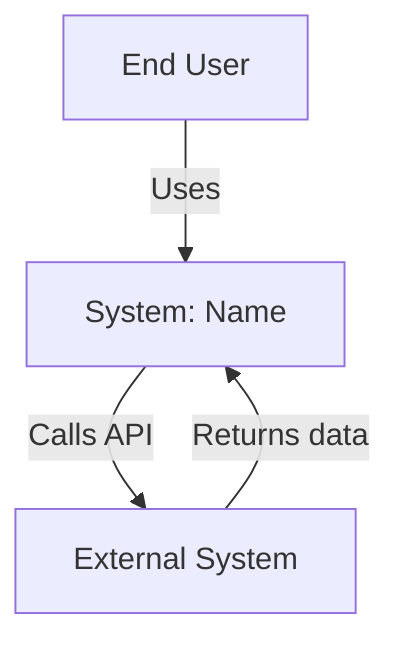
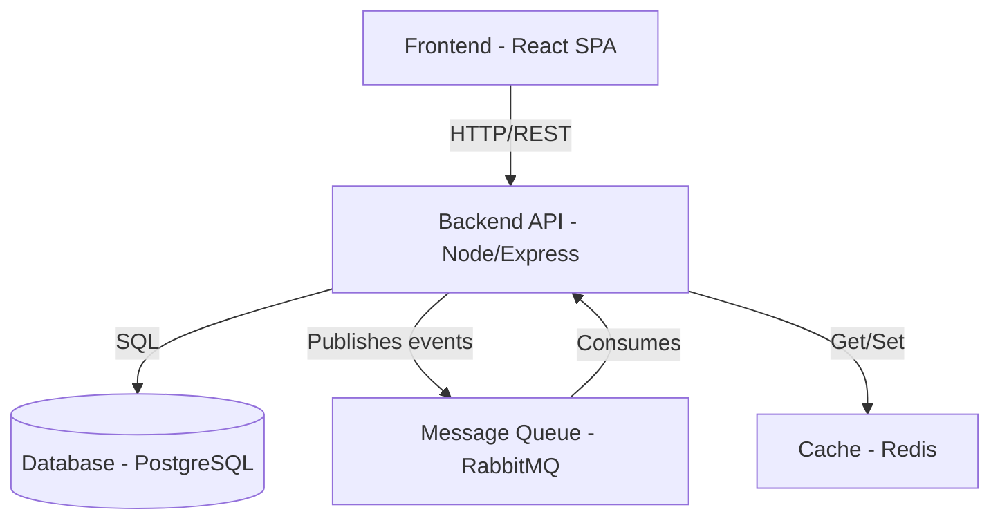
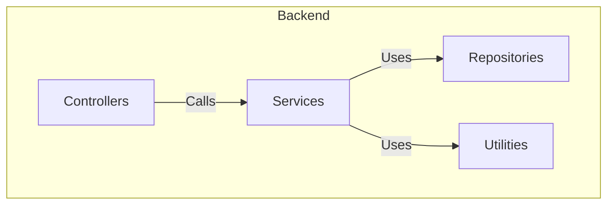
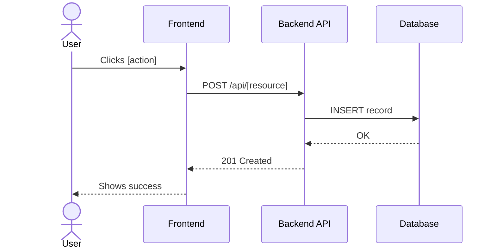
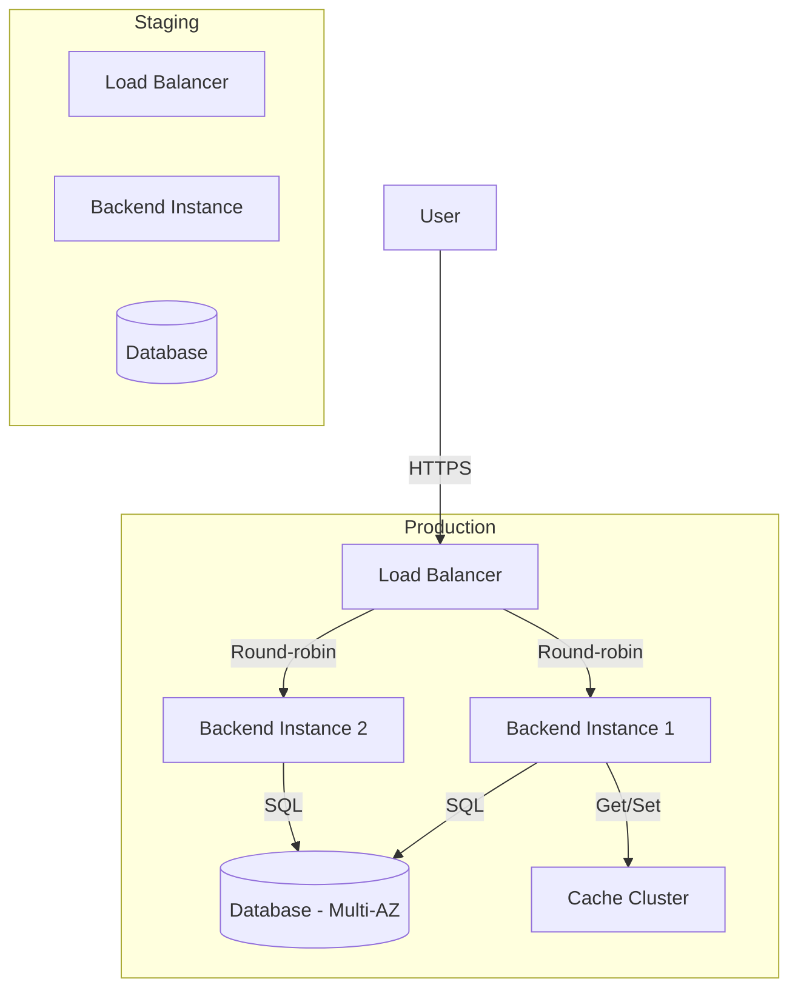

# Architecture Diagram Template

## Responsaveis

- **Owner:** Tech Lead
- **Contribuem:** PM, Dev team, DevOps
- **Aprovacao:** PM + Tech Lead

## Table of Contents

1. [Expected Sections](#expected-sections)
2. [1. General Context View](#1-general-context-view)
3. [2. C4 Level 1: Context Diagram](#2-c4-level-1-context-diagram)
4. [3. C4 Level 2: Container Diagram](#3-c4-level-2-container-diagram)
5. [4. C4 Level 3: Component Diagram](#4-c4-level-3-component-diagram-optional-if-microservices)
6. [5. Technology Stack](#5-technology-stack)
7. [6. Main Flows](#6-main-flows-sequence-diagrams)
8. [7. Deployment Diagram](#7-deployment-diagram)
9. [8. Architectural Pattern Decisions](#8-architectural-pattern-decisions)
10. [9. Scalability Considerations](#9-scalability-considerations)
11. [10. Architectural Risks & Mitigations](#10-architectural-risks--mitigations)
12. [Completeness Checklist](#checklist-of-completeness)
13. [Example Final Structure](#example-of-final-structure)

---

## Expected Sections

This document describes the complete architectural vision of the system using C4 model, technology stack, and deployment diagrams.

### 1. General Context View

**Description:** Executive summary of the architecture.
- System name
- Main objective
- Chosen architectural pattern (monolith/microservices/serverless)
- Main actors

**Example:**
```
# System Architecture

The [System Name] follows a **[chosen pattern]** pattern with [brief description].

Main actors:
- End users (via web/mobile)
- Administrators
- External systems ([list])

Pillars: [technology 1], [technology 2], [summarized stack]
```

---

## 2. C4 Level 1: Context Diagram

**What it shows:** System as black box, with users and external systems.

**Elements:**
- [System] (center)
- Users/personas
- External systems (APIs, external databases, third-party services)
- Data flows (arrows with description)

**Mermaid Format:**


**Expected output:**
- Mermaid C4 Context diagram
- Description of each actor and external integration
- Communication protocols (HTTP, gRPC, events)

---

## 3. C4 Level 2: Container Diagram

**What it shows:** System deployment containers (frontend, backend, database, queue, etc.).

**Elements by project:**
- Frontend (web, mobile, SPA)
- Backend (API, services)
- Database (data store)
- Message Queue (events, async jobs)
- Cache (Redis, Memcached)
- External services (Auth, Payment, Analytics)

**Mermaid Format:**


**Expected output:**
- Mermaid diagram with all containers
- Technology of each container (name: tech)
- Protocols between containers
- Responsibility of each container (1 sentence)

---

## 4. C4 Level 3: Component Diagram (optional, if microservices)

**What it shows:** Internal components of the backend (or main service).

**Elements:**
- Controllers/Handlers
- Services (business logic)
- Repositories (data access)
- Utilities, formatters, validators
- Clients (for external APIs)

**Mermaid Format:**


**Expected output:**
- Mermaid diagram with main components
- Dependencies between components
- Layer pattern (MVC, Clean Architecture, etc.)

---

## 5. Technology Stack

**Description:** Technology choices for each container/component.

**Table format:**

| Layer       | Component          | Technology          | Version | Justification                          |
|-------------|---------------------|---------------------|--------|----------------------------------------|
| Frontend    | Web App              | React               | 19.x   | [reason for choice]                    |
|             | Mobile              | React Native        | 0.76.x | [reason]                               |
| Backend     | Main API            | Node.js + Express   | 20.x   | [reason]                               |
|             | Async Worker        | Bull (jobs)         | 5.x    | [reason]                               |
| Data        | Primary DB          | PostgreSQL          | 16.x   | [reason]                               |
|             | Cache               | Redis               | 7.x    | [reason]                               |
| Queue       | Message Broker      | RabbitMQ            | 3.13   | [reason]                               |
| Hosting     | Compute             | AWS EC2 / Heroku    | -      | [reason]                               |
|             | Database Host       | AWS RDS / Managed   | -      | [reason]                               |

**Expected output:**
- Complete stack table
- 1-2 lines of justification per choice (based on PRD requirements)

---

## 6. Main Flows (Sequence Diagrams)

**Description:** Sequence diagrams for critical system flows.

**Examples:**
- Authentication flow
- Payment flow
- Main resource creation flow
- Notification flow

**Mermaid Format:**


**Expected output:**
- 2-4 main flow diagrams
- Each flow shows complete path (user → frontend → backend → database)

---

## 7. Deployment Diagram

**Description:** How the system is deployed in production.

**Elements:**
- Environments (dev, staging, prod)
- Machines/containers (EC2, ECS, Kubernetes, etc.)
- Load balancers
- CDN
- Monitoring
- Backup

**Mermaid Format:**


**Expected output:**
- Deployment diagram showing environments
- Number of instances, redundancy
- Database (multi-AZ, backup)
- CDN and caching strategy

---

## 8. Architectural Pattern Decisions

**Description:** Justification of main architectural decisions.

**Format:**

#### Main Pattern: [Monolith | Microservices | Serverless]

**Decision:** [Which pattern was chosen]

**Justification:**
- Aligns with PRD requirements? [yes/how]
- Scalability: [how it supports growth]
- Complexity: [level of operational complexity]
- Team: [team size required]

**Trade-offs:**
- Pros: [list]
- Cons: [list]
- Mitigations: [how to mitigate]

---

#### Data Pattern: [Relational | NoSQL | Hybrid]

**Decision:** [Which pattern was chosen]

**Justification:** [based on data requirements from PRD]

---

#### Communication Pattern: [Synchronous | Asynchronous | Hybrid]

**Decision:** [Which pattern was chosen]

**Justification:** [based on latency and scalability]

---

#### Authentication & Authorization: [OAuth2 | JWT | Custom | etc]

**Decision:** [Which pattern was chosen]

**Justification:** [based on security requirements]

---

## 9. Scalability Considerations

**Description:** How the system scales with user growth.

| Metric              | Year 1    | Year 2    | Year 3    |
|----------------------|----------|----------|----------|
| Active users         | 10K      | 100K     | 1M       |
| Requests/second      | 100 RPS  | 1K RPS   | 10K RPS  |
| Data stored          | 10 GB    | 100 GB   | 1 TB     |
| Target latency (p95) | 200ms    | 200ms    | 200ms    |

**Scaling strategy:**
- Horizontal vs Vertical scaling
- Cache invalidation strategy
- Database partitioning/sharding
- CDN usage
- Async processing for heavy operations

**Expected output:**
- Growth projection
- Scaling strategy per layer
- Bottleneck points and how to mitigate

---

## 10. Architectural Risks & Mitigations

| Risk                      | Severity | Mitigation                              |
|----------------------------|----------|----------------------------------------|
| [Risk 1]                  | High     | [How to mitigate]                      |
| [Risk 2]                  | Medium   | [How to mitigate]                      |
| [Risk 3]                  | Low      | [How to mitigate]                      |

**Expected output:**
- 3-5 main risks
- Severity assessment
- Concrete mitigation plan

---

## Checklist of Completeness

Before marking as complete:
- [ ] C4 Context diagram (Mermaid) exists and shows actors + external systems
- [ ] C4 Container diagram (Mermaid) shows all main containers
- [ ] C4 Component diagram (Mermaid, if applicable) shows internal structure
- [ ] Technology Stack table is complete with justifications
- [ ] 2-4 flow diagrams (sequence) for main use cases
- [ ] Deployment diagram shows environments and infrastructure
- [ ] Architectural pattern decisions explained (main, data, communication, auth)
- [ ] Scalability considerations documented (3-year projection)
- [ ] Architectural risks identified and mitigations planned
- [ ] All Mermaid diagrams have valid syntax
- [ ] Language in English
- [ ] Document is well-structured and readable

## Example of Final Structure

```
# Architecture of [System]

## 1. General View
[Summary, main pattern]

## 2. C4 Context Diagram
[Mermaid diagram]

## 3. C4 Container Diagram
[Mermaid diagram]

## 4. C4 Component Diagram
[Mermaid diagram, if applicable]

## 5. Technology Stack
[Table]

## 6. Main Flows
### Authentication Flow
[Sequence diagram]

### [Use Case 1] Flow
[Sequence diagram]

## 7. Deployment
[Mermaid diagram]

## 8. Patterns & Decisions
### Main Pattern
[Decision + justification + trade-offs]

### Data Pattern
[...]

### Communication Pattern
[...]

### Authentication
[...]

## 9. Scalability
[Projection + strategy]

## 10. Risks & Mitigations
[Table]
```

---

**Version:** 1.0
**Language:** English (en-US)
**Model:** C4 Architecture + Technology Stack + Deployment

## O que fazer / O que nao fazer

**O que fazer:**
- Justificar cada decisao de tech stack com tradeoffs
- Mostrar componentes E suas conexoes (nao so listar)
- Incluir dependencias externas e integracoes
- Usar Mermaid para diagramas (versionavel, editavel)

**O que nao fazer:**
- Nao detalhar implementacao (isso e codigo)
- Nao escolher tecnologia sem considerar alternativas
- Nao ignorar requisitos nao-funcionais na arquitetura
- Nao criar diagramas que so o autor entende

