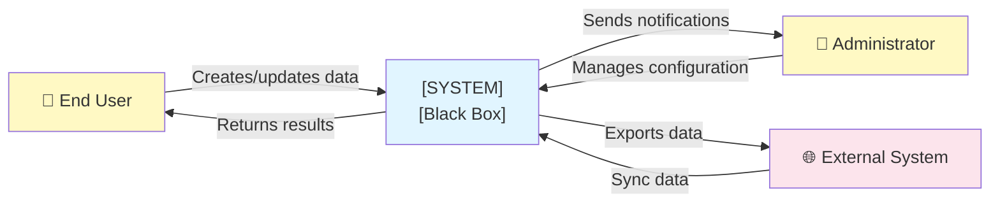
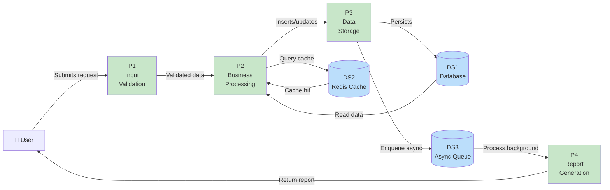

---
doc_meta:
  id: data-flow-diagram
  display_name: "Data Flow Diagram"
  pillar: Design
  phase: Data Design
  sequence: 5
  updated: "2026-03-14"
  status: template
---

# Data Flow Diagram (DFD)

**Document:** data-flow-diagram.md
**Responsibility:** Visualize movement of data between components, processes, and storage
**Recipients:** Systems architects, data engineers, implementation engineers

---
## Responsaveis

- **Owner:** Data/BI Lead
- **Contribuem:** Tech Lead, Dev team
- **Aprovacao:** Tech Lead


## Table of Contents

- [DFD Level 0 (Context)](#dfd-level-0-context)
- [DFD Level 1 (Detailed Processes)](#dfd-level-1-detailed-processes)
- [Data Stores](#data-stores)
- [External Entities](#external-entities)
- [Data Transformations](#data-transformations)
- [Cross-Process Flows](#cross-process-flows)
- [Storage Relationships](#storage-relationships)
- [Consistency Guarantees](#consistency-guarantees)
- [Pipeline Monitoring](#pipeline-monitoring)
- [Next Steps](#next-steps)

---

## DFD Level 0 (Context)



**Description:**
- **End User**: Interacts with the system via UI
- **Administrator**: Manages domains, configuration, users
- **System**: Black box that processes data
- **External System**: Integrations (webhooks, third-party APIs)

---

## DFD Level 1 (Detailed Processes)



---

## Data Stores

### DS1: PostgreSQL Database

| Property | Value |
|----------|-------|
| **Storage** | `ets_production` (PostgreSQL 15) |
| **Tables** | [ENTITY-A], [ENTITY-B], [ENTITY-C], [ENTITY-D], [ENTITY-E] |
| **Capacity** | [X] GB |
| **Access Frequency** | Continuous (read + write) |
| **Latency** | < 50ms (p95) |
| **Backup** | Daily, 30-day retention |
| **Location** | Hetzner VPS (Frankfurt) |

**Access:**
- Read: All processes
- Write: P3 (Storage), Async workers
- Update: P2 (Processing), cron jobs

---

### DS2: Redis Cache

| Property | Value |
|----------|-------|
| **Storage** | Redis 7.0 |
| **Default TTL** | 1 hour |
| **Data Types** | Strings, Hashes, Sets |
| **Max Size** | [Y] GB |
| **Access Frequency** | High (read-heavy) |
| **Latency** | < 5ms |
| **Eviction Policy** | LRU (Least Recently Used) |

**Cached Data:**
- Domain configuration (5min TTL)
- User sessions (24h TTL)
- Aggregated counters (1h TTL)

---

### DS3: Message Queue (Async Queue)

| Property | Value |
|----------|-------|
| **Storage** | Redis Queue (RQ) or Bull |
| **Retention** | 7 days (completed) |
| **Frequency** | Continuous enqueueing |
| **Processing SLA** | < 5 minutes |
| **Dead Letter Queue** | Enabled, monitored |

**Job Types:**
- Report generation (long-running)
- Data synchronization (batch)
- Asynchronous notifications
- Cache cleanup

---

## External Entities

| Entity | Type | Interaction | Frequency |
|--------|------|-----------|-----------|
| **End User** | Actor | UI: login, create data, query | Continuous |
| **Administrator** | Actor | Admin UI: manage domains | Daily |
| **External System A** | System | Webhook inbound: sync data | Every 1h |
| **External System B** | System | API call: export data | On demand |
| **Email Provider** | Service | Send notifications | Per trigger |

---

## Data Transformations

### P1: Input Validation

**Input:**
- HTTP request (JSON payload)

**Processing:**
```
IF payload.schema != valid THEN
    RETURN 400 Bad Request
ELSE IF payload.entity_id not in DB THEN
    RETURN 404 Not Found
ELSE IF user not authorized THEN
    RETURN 403 Forbidden
ELSE
    PASS to P2
END
```

**Output:**
- Validated data (passed to P2)
- Errors (returned to client)

---

### P2: Business Processing

**Input:**
- Validated data from P1
- Configuration from cache (DS2)
- Historical data from DB (DS1)

**Processing:**
```
1. Load user context (cache)
2. Enrich data with business rules
3. Calculate derived fields
4. Verify integrity constraints
5. Prepare for persistence
```

**Output:**
- Processed and enriched data
- To P3 (persistence)
- Response to user

---

### P3: Data Storage

**Input:**
- Processed data from P2

**Processing:**
```
BEGIN TRANSACTION
1. INSERT/UPDATE in DS1 (main database)
2. IF SUCCESS THEN
    - Invalidate relevant cache (DS2)
    - Enqueue async job (DS3)
    - COMMIT
ELSE
    - ROLLBACK
    - Return error
END TRANSACTION
```

**Output:**
- Persistence confirmed (202 Accepted)
- Async job enqueued
- Cache updated

---

### P4: Report Generation

**Input:**
- Report job (DS3)
- Data from database (DS1)

**Processing:**
```
1. Aggregate data according to filters
2. Apply statistical calculations
3. Format output (PDF/CSV/JSON)
4. Compress if necessary
5. Store or send
```

**Output:**
- Generated report (file or stream)
- Notification to user
- Access audit

---

## Cross-Process Flows

### Flow 1: Create New Entity

```
User → P1 (validation) → P2 (processing) → P3 (storage)
                             ↓
                      DS2 (cache invalidate)
                      DS3 (async job enqueued)
                             ↓
                      P4 (background report)
```

**End-to-end latency:** < 1 second (P1-P3), + async (P4)

---

### Flow 2: Query Data

```
User → P1 (validation) → P2 (processing)
                              ↓
                      DS2 (cache hit/miss)
                              ↓
                          DS1 (DB query)
                              ↓
                          P2 (enrich)
                              ↓
                      User (response)
```

**End-to-end latency:** < 100ms (cache hit), < 500ms (cache miss + DB)

---

### Flow 3: External System Sync

```
External System → Webhook → P1 (validate) → P2 (process)
                                                ↓
                                            P3 (store)
                                                ↓
                                            DS1 (persist)
                                                ↓
                                      External System (ACK)
```

**Latency:** < 5 seconds
**Retry:** Exponential backoff up to 3 attempts

---

## Storage Relationships

| Relationship | Frequency | Consistency | Mechanism |
|---|---|---|---|
| DS1 ↔ DS2 | Continuous | Eventual | Cache invalidate, TTL |
| DS1 ↔ DS3 | Continuous | Eventual | Job enqueue/dequeue |
| DS1 → DS3 → Reports | Asynchronous | Eventual | Background job |

---

## Consistency Guarantees

### Strong Consistency (Transactional)

- **Processes:** P1, P2, P3 (during write)
- **Storage:** DS1 (ACID)
- **Mechanism:** BEGIN TRANSACTION ... COMMIT

### Eventual Consistency (Async)

- **Processes:** P4 (background)
- **Storage:** DS2 (cache), DS3 (queue)
- **SLA:** < 5 minutes for convergence

---

## Pipeline Monitoring

### Pipeline Metrics

| Metric | Target | Alerts |
|--------|--------|---------|
| P1 throughput | > 1000 req/s | < 500 req/s |
| P1 latency (p95) | < 50ms | > 100ms |
| P2 latency (p95) | < 100ms | > 200ms |
| P3 latency (p95) | < 200ms | > 500ms |
| DS1 query latency (p95) | < 50ms | > 100ms |
| DS2 hit rate | > 80% | < 70% |
| DS3 queue depth | < 1000 jobs | > 5000 jobs |
| P4 backlog | < 30 min | > 60 min |

---


## O que fazer / O que nao fazer

**O que fazer:**
- Rotular cada fluxo com volume e frequencia
- Distinguir fluxos sincronos de assincronos
- Alinhar nomes de processos com architecture-diagram
- Documentar transformacoes com input/output

**O que nao fazer:**
- Nao criar fluxos sem storage destino
- Nao omitir fluxos de erro e retry
- Nao ignorar latencia e SLA por fluxo
- Nao misturar niveis de detalhe (DFD 0 e DFD 1 separados)

## Next Steps

✅ Move to **data-catalog** (Complete asset inventory)
✅ Move to **api-spec** (Endpoints based on this DFD)
