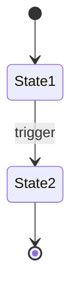

# Template: Feature Spec

**File:** `docs/ets/projects/{project-slug}/planning/feature-specs/feature-spec-[kebab-name].md`

**Purpose:** Detailed technical documentation of complex features. Single Source of Truth for business rules, state machines, validations, error handling.

## Responsaveis

- **Owner:** PM (Product Manager)
- **Contribuem:** Tech Lead, Dev team, QA
- **Aprovacao:** PM + Tech Lead

## Table of Contents
1. [Complete Structure](#complete-structure)
2. [Filling Notes](#filling-notes)
3. [Concrete Example](#concrete-example-minimal)
4. [Validation](#validation)

---

## Complete Structure

```markdown
# Feature Spec: [Feature Name]

## Overview

**Linked to:** US-# (link to user-story)

**Priority:** [Must Have / Should Have / Could Have] (inherited from US-#)

**Complexity:** [Reason for having spec: >3 business rules / state machine / complex validation]

**Description:** [2-3 paragraphs about feature]

---

## Business Rules

All business rules that define behavior.

### FS-[kebab-name]-1: [Rule Title]

**Description:** [Clear statement of the rule]

**When Applies:** [Condition / context]

**Result:** [What system does / what state results]

**Example:** [Concrete scenario]

---

### FS-[kebab-name]-2: [Rule Title]

[Repeat structure above]

---

## State Machine

[If feature has multiple states]

### States

| State | Description | Terminal? |
|-------|-------------|-----------|
| Draft | Not saved yet | No |
| Saved | Data validated | No |
| Sent | Sent to client | No |
| Paid | Payment received | Yes |
| Overdue | Overdue without payment | No |
| Cancelled | Cancelled | Yes |

### Valid Transitions

```
stateDiagram-v2
  [*] --> Draft
  Draft --> Saved: Save
  Draft --> Cancelled: Cancel
  Saved --> Sent: Send
  Sent --> Paid: Receive Payment
  Sent --> Overdue: 30 days pass
  Overdue --> Paid: Receive Late Payment
  Paid --> [*]
  Cancelled --> [*]
```

### Invalid Transitions (Explicitly NOT Allowed)

- Paid → Draft (cannot reverse payment via status)
- Cancelled → * (cancellation is final)
- Overdue → Draft (cannot revert to draft)

---

## Validation Rules

Validations that must run on each operation.

| Validation | Condition | Error Message | Affected Field |
|-----------|-----------|--------------|-----------------|
| Client Required | client_id == null | "Client is required" | client_id |
| Email Valid | !isValidEmail(email) | "Invalid email" | email |
| Status Allowed | status not in [Draft, Saved, Sent, Paid] | "Invalid status" | status |
| Can Duplicate? | original.status not in [Saved, Sent, Paid] | "Cannot duplicate invoice in Draft" | N/A |

---

## Error Handling Matrix

For each EDGE-# relevant to this feature, document the handling:

| EDGE-# | Scenario | Trigger | System Response | User Message | Retry? | Rollback? |
|--------|----------|---------|-----------------|--------------|--------|-----------|
| EDGE-1 | [description] | [what triggers it] | [what system does] | [what user sees] | Yes/No | Yes/No |
| EDGE-2 | [description] | [what triggers it] | [what system does] | [what user sees] | Yes/No | Yes/No |

---

## Error Handling & Recovery

### Error 1: [Error Title]

**Condition:** [When error occurs]

**User Message:** [Exactly what user sees]

**System Recovery:**
  1. [Step 1]
  2. [Step 2]
  3. [Final result]

**Retry?** [Yes / No / Depends]

**Timeout?** [If applicable]

---

### Error 2: [Error Title]

[Repeat structure above]

---

## State Machine

[Mandatory if feature has >2 states]

### State Diagram



### Valid Transitions

| From | To | Trigger | Side Effects |
|------|-----|---------|-------------|
| State1 | State2 | [trigger event] | [what happens as consequence] |

### Forbidden Transitions

| From | To | Reason |
|------|-----|--------|
| State2 | State1 | [why this is not allowed] |

---

## Permission Matrix

| Action | Public | User | Editor | Admin | Superadmin |
|--------|--------|------|--------|-------|------------|
| [action 1] | - | Read | Read/Write | Full | Full |
| [action 2] | - | - | Read | Read/Write | Full |

---

## Edge Cases

### Edge Case 1: [Description]

**Situation:** [When this happens]

**Expected Behavior:** [What system does]

**Reason:** [Why this is the correct behavior]

---

### Edge Case 2: [Description]

[Repeat structure above]

---

## Data Transformations

[If feature transforms data]

### Transformation 1: [Operation]

**Input:**
```
{
  "invoice_id": "123",
  "client": { ... },
  "items": [ ... ]
}
```

**Transformation:**
1. [Step 1]
2. [Step 2]
3. [Step 3]

**Output:**
```
{
  "new_invoice_id": "456",
  "original_invoice_id": "123",
  "client": { ... },
  "items": [ ... (copied) ],
  "status": "Draft",
  "created_at": "(now)"
}
```

**Null Handling:**
- If `description` is null → Default: ""
- If `due_date` is null → Default: 30 days from now
- If `custom_fields` is null → Default: {}

---

## Business Logic Decisions

### Decision 1: [Decision Point]

**Question:** [What to decide]

**Options:**
  A) [Option 1]
  B) [Option 2]
  C) [Option 3]

**Chosen:** [Which we chose and why]

**Rationale:** [Business justification]

---

## Testing Scenarios

[Sets of test cases derived from rules + states + errors]

### Scenario 1: [Description]

**Setup:** [Pre-conditions]
**Action:** [What system does]
**Expected Result:** [Expected result]
**Coverage:** Covers rules: FS-[kebab-name]-1, FS-[kebab-name]-3; State: Draft → Saved

---

## Traceability

| Document | Link |
|----------|------|
| User Story | US-# (docs/ets/projects/{project-slug}/planning/user-stories.md) |
| PRD Feature | PRD-F-# (docs/ets/projects/{project-slug}/planning/prd.md) |
| Implementation | impl-# (docs/implementation/implementation-plan.md) when created |

---

## Approval & Sign-Off

**Date Created:** [YYYY-MM-DD]
**Last Updated:** [YYYY-MM-DD]
**Author:** [Skill: feature-spec]
**Reviewed By:** [User]
**Status:** [Draft / Approved / Deprecated]

```

---

## Filling Notes

### Overview

- **Linked to:** Which US-# this spec details
- **Priority:** Inherited from US-# (Must/Should/Could)
- **Complexity:** Summarize WHY feature qualified for spec
  - Example: "State machine with 6 states and complex transitions"
  - Example: "8 business rules with validations and dependencies"

### Business Rules

**FS-[kebab-name]-# structure:**

```
### FS-[kebab-name]-1: [Rule Name]

**Description:** [One clear sentence stating the rule]

**When Applies:** [Context / condition triggers]

**Result:** [What system does / what state results]

**Example:** [Concrete scenario with data]
```

**Good Rules:**
```
FS-payment-tracking-1: When payment is received, invoice changes to "Paid"

FS-duplicate-invoice-2: Cannot duplicate invoice in "Draft" or "Cancelled" status

FS-email-sending-3: If email fails, system retries up to 3 times with exponential backoff
```

**Bad Rules:**
```
FS-feature-1: System should work good

FS-feature-2: User wants to do something
```

**Minimum:** 3-4 rules (if fewer, may not qualify for spec)

### State Machine

**When to include:** Feature has multiple states with transitions.

**Complete Example:**

```
### States

| State | Description | Terminal? |
|-------|-------------|-----------|
| Draft | Form in progress, not saved | No |
| Saved | Saved, ready to send | No |
| Sent | Sent to client, awaiting payment | No |
| Paid | Payment received | Yes |
| Overdue | Not paid after 30 days | No |
| Archived | Cannot modify anymore | Yes |

### Valid Transitions (Mermaid stateDiagram-v2)

```
stateDiagram-v2
  [*] --> Draft
  Draft --> Saved: save()
  Draft --> [*]: cancel() / delete
  Saved --> Sent: send()
  Saved --> Draft: edit()
  Sent --> Paid: markPaid()
  Sent --> Overdue: [30 days elapsed]
  Overdue --> Paid: markPaid()
  Paid --> Archived: archive()
  Archived --> [*]
```

### Invalid Transitions (Explicitly NOT OK)

- Paid → Draft (cannot reverse payment)
- Sent → Draft (cannot re-edit after send)
- Archived → Paid (cannot return from archive)

**General Rule:** Once Paid or Archived, no reverting (only forward or terminal).
```

### Validation Rules

**Table format:**

| Validation | Condition | Error Message | Field |
|-----------|-----------|--------------|-------|
| [Name] | [Boolean expression] | [Exact message user sees] | [Field validated] |

**Good Examples:**

```
| Client Exists | client_id && clients.exists(client_id) | "Client not found" | client_id |
| Email Valid | isValidEmail(email) | "Invalid email. Format: user@domain.com" | email |
| Status Allowed | status in ['Draft','Sent','Paid'] | "Status not allowed" | status |
| Can Duplicate | original.status in ['Sent','Paid'] | "Cannot duplicate invoice in Draft" | N/A |
```

### Error Handling & Recovery

**Structure per error:**

```
### Error 1: [Error Name]

**Condition:** [When error occurs]
Example: "Email server not responding"

**User Message:** [EXACT message user sees]
Example: "Failed to send email. Try again in a few minutes."

**System Recovery:**
  1. Automatic retry 3x with exponential backoff (1s, 2s, 4s)
  2. If permanent failure, log error with ID
  3. Notify user: "Email will be sent as soon as possible"

**Retry?** Yes (up to 3x)
**Timeout?** 30 seconds per attempt
```

**Common Errors for Features:**

- Validation fails (invalid user input) → No retry, clear message, user corrects
- External API fails (email, payment gateway) → Automatic retry + async retry
- Database fails → Automatic retry, eventual notification
- Permission denied (user not authorized) → No retry, clear message, maybe suggest escalation

### Error Handling Matrix

**When to include:** Always. Map upstream EDGE-# scenarios to concrete system responses.

**Table format:**

| EDGE-# | Scenario | Trigger | System Response | User Message | Retry? | Rollback? |
|--------|----------|---------|-----------------|--------------|--------|-----------|
| EDGE-1 | [description] | [what triggers it] | [what system does] | [what user sees] | Yes/No | Yes/No |

### State Machine (Filling Notes)

**When to include:** Mandatory if feature has >2 states. Use Mermaid `stateDiagram-v2`.

Include:
- State diagram (Mermaid)
- Valid transitions table: From | To | Trigger | Side Effects
- Forbidden transitions table: From | To | Reason

### Permission Matrix

**When to include:** Always. Define who can do what.

**Table format:**

| Action | Public | User | Editor | Admin | Superadmin |
|--------|--------|------|--------|-------|------------|
| [action] | - | [access level] | [access level] | [access level] | [access level] |

Roles should match the project's role definitions. Adjust columns to match actual roles if different.

### Edge Cases

**What to include:** Rare BUT valid situations system must handle.

**Examples:**

```
### Edge Case 1: Duplicate invoice with 0 items

**Situation:** User clicks duplicate on invoice with items but items were deleted afterward

**Expected Behavior:**
  - System creates new draft with 0 items
  - Shows warning: "Original invoice has 0 items"
  - User can add items later

**Reason:** Don't fail duplication just because original is empty


### Edge Case 2: Invoice for deleted client

**Situation:** Invoice links to client_id that no longer exists (client was deleted)

**Behavior:**
  - Invoice stays with invalid client_id
  - Operations like "Send" show error: "Client not found"
  - User can delete invoice or contact support to restore client

**Reason:** Data integrity: don't delete invoices when deleting client (audit trail)
```

### Data Transformations

**When to include:** Feature that transforms/copies/creates data.

**Complete Example:**

```
### Transformation: Duplicate Invoice

**Input:** Original invoice object + user_id + new due_date (optional)

**Transformation:**
  1. Copy all fields from original (client, items, notes)
  2. Generate new invoice_id (UUID)
  3. Set status = "Draft"
  4. Set created_at = now()
  5. Set created_by = current_user_id
  6. Set parent_invoice_id = original.invoice_id (audit trail)
  7. If new_due_date provided, use it; else add 30 days to original due_date
  8. Copy all items: for each item, copy qty, description, rate (not item_id)
  9. Recalculate totals (subtotal, tax, total)

**Output:** New invoice object (Draft status, ready to send)

**Null Handling:**
  - If original.description = null → new.description = ""
  - If original.tax_rate = null → new.tax_rate = 0
  - If original.custom_fields = {} (empty) → new.custom_fields = {}
  - If client.address = null → new keeps as null (to be filled later)
```

### Business Logic Decisions

**When to include:** Major decision points where there are alternatives but we chose 1.

**Example:**

```
### Decision: Can User Edit Sent Invoice?

**Question:** After invoice is sent to client, can user edit?

**Options:**
  A) Don't allow edits (lock after send)
  B) Allow edits but create new version (versioning)
  C) Allow edits but mark as "Modified" and notify client

**Chosen:** A) Don't allow edits (lock after send)

**Rationale:**
  - Simple implementation
  - Clear audit (sent version is immutable)
  - Forces user to use "Duplicate" if they need to create new invoice
  - Avoids confusion: which version did client see?

**Tradeoff:** User who wants to fix detail must duplicate + send again
```

### Testing Scenarios

**Derived from rules + states + errors.**

```
### Scenario 1: Happy path - create and send invoice

**Setup:**
  - User logged in
  - Client saved
  - Items available

**Action:**
  1. Click "New Invoice"
  2. Fill client (auto-complete)
  3. Add items (3 items)
  4. Review totals
  5. Click "Save"
  6. Click "Send"

**Expected Result:**
  - Invoice saved with status "Saved" (FS-create-1 ✓)
  - Email sent with PDF (FS-send-1 ✓)
  - Status changed to "Sent" (FS-state-machine ✓)
  - Totals calculated correctly (FS-calculation-2 ✓)

**Coverage:** Rules 1,2,4,5; State Draft→Saved→Sent


### Scenario 2: Error path - send email fails

**Setup:** Invoice created, ready to send, but SMTP is down

**Action:** Click "Send"

**Expected Result:**
  - System tries to send, gets timeout error
  - Retries automatically (hidden from user)
  - After 3 retries, shows message: "Failed to send. Try later." (FS-error-1 ✓)
  - Invoice stays in "Sent" status (optimistic, retry continues in background)
  - When SMTP recovers, email is sent automatically (FS-async-retry-2 ✓)

**Coverage:** Error handling FS-error-1, async behavior FS-async-1
```

### Approval & Sign-Off

Fields to track:

```
**Date Created:** 2026-03-14
**Last Updated:** 2026-03-14
**Author:** feature-spec skill (automated)
**Reviewed By:** [User name]
**Status:** Approved
```

---

## Concrete Example (Minimal)

```markdown
# Feature Spec: Payment Tracking

## Overview

**Linked to:** US-5 (Mark invoice as paid)

**Priority:** Should Have

**Complexity:** State machine with multiple states + error handling

**Description:**
Feature that allows freelancer to mark invoice as paid and track payment status.
Involves state transitions (Sent → Paid), validation (data valid?), error handling (fail to save?).

---

## Business Rules

### FS-payment-tracking-1: State Change on Mark Paid

When freelancer clicks "Mark as Paid", invoice changes from status "Sent" to "Paid".

**When Applies:** Invoice is in status "Sent" (was sent)

**Result:** Status = "Paid", paid_at = today, paid_method = recorded

**Example:** Invoice #123 was sent 2 days ago. Freelancer clicks "Mark as Paid".
Status changes to "Paid", dashboard updates total pending (subtracts this value).

---

### FS-payment-tracking-2: Cannot Mark Non-Sent as Paid

Invoices in status "Draft" or "Cancelled" cannot be marked as paid.

**When Applies:** User tries to mark invoice Draft/Cancelled as paid

**Result:** System shows error "Cannot mark as paid. Invoice must be Sent."

---

### FS-payment-tracking-3: Track Payment Date & Method

When marked as paid, system records:
  - Payment date (when)
  - Payment method (check, transfer, credit card, cash)

**Result:** Dashboard shows "Paid on [date] via [method]"

---

## State Machine

### States

| State | Description | Terminal? |
|-------|-------------|-----------|
| Draft | Draft, not sent | No |
| Sent | Sent to client, awaiting payment | No |
| Paid | Payment received | Yes |
| Overdue | Not paid after 30 days | No |
| Cancelled | Cancelled | Yes |

### Valid Transitions

```
stateDiagram-v2
  [*] --> Draft
  Draft --> Sent: Send
  Sent --> Paid: Mark Paid
  Sent --> Overdue: [30 days elapsed]
  Overdue --> Paid: Mark Late Payment
  Paid --> [*]
  Cancelled --> [*]
```

---

## Error Handling

### Error 1: Payment Date in Future

**Condition:** User tries to mark invoice as paid with future date

**User Message:** "Payment date cannot be in the future"

**System Recovery:**
  1. Show error message
  2. Auto-fill payment_date with today
  3. Allow user to correct and retry

**Retry?** Yes

---

### Error 2: Save Fails (Database Error)

**Condition:** Database does not respond when saving status change

**User Message:** "Failed to save. Try again in a few minutes."

**System Recovery:**
  1. Log error
  2. Show friendly message to user
  3. Async retry every 30s until success
  4. Notify user when resolved

**Retry?** Yes (automatic in background)

---

## Testing Scenarios

### Scenario 1: Mark invoice as paid - Happy Path

Setup: Invoice in status "Sent"
Action: Click "Mark as Paid", select payment method, confirm
Expected: Status changes to "Paid", dashboard updates

### Scenario 2: Try mark Draft invoice as paid

Setup: Invoice in status "Draft"
Action: Click "Mark as Paid"
Expected: Error message "Cannot mark as paid. Send first."

### Scenario 3: Payment date validation

Setup: Invoice in "Sent"
Action: Click "Mark as Paid", enter future date
Expected: Error "Date cannot be future", auto-fill today

```

---

## Validation

**Before finalizing feature-spec-[kebab-name].md:**

- [ ] Overview linked to correct US-#
- [ ] Priority inherited from US-# (Must/Should/Could)
- [ ] Complexity justified (>3 rules or explicit state machine)
- [ ] FS-[kebab-name]-# IDs sequential for rules
- [ ] Each rule has: Description, When Applies, Result, Example
- [ ] State machine (if applicable) with correct Mermaid diagram
- [ ] Invalid transitions explicitly documented
- [ ] Validation rules in clear table
- [ ] Error handling matrix with EDGE-# references present
- [ ] State machine with valid/forbidden transitions (if >2 states)
- [ ] Permission matrix with role-based access for all actions
- [ ] Error handling scenarios covered (common errors)
- [ ] Edge cases documented (rare BUT valid situations)
- [ ] Data transformations described (if feature transforms data)
- [ ] Business logic decisions justified (if there are alternatives)
- [ ] Testing scenarios cover rules + states + errors
- [ ] Clear traceability (links to US-#, PRD-F-#)
- [ ] Language is English

---

## When NOT to Use Feature Spec

If feature is:
- ✅ Simple CRUD (create, edit, delete with basic validation)
- ✅ Linear flow (no multiple states)
- ✅ <3 business rules
- ✅ User-stories Given/When/Then is clear and sufficient

→ Keep only as user-story, DO NOT create feature-spec.

Example: "Add new client" (name, email, address) → Simple CRUD → No spec needed.
Example: "Duplicate invoice with recalculation and versioning" → State machine + 8 rules → Feature spec needed.

## O que fazer / O que nao fazer

**O que fazer:**
- Numerar todas as regras de negocio com FS-# IDs
- Incluir exemplos concretos para cada regra
- Documentar transicoes invalidas explicitamente
- Cobrir edge cases com comportamento esperado

**O que nao fazer:**
- Nao detalhar implementacao (isso e codigo)
- Nao criar feature-spec para CRUD simples (<3 regras)
- Nao copiar Given/When/Then do user-stories (referenciar, nao duplicar)
- Nao deixar regras ambiguas ("o sistema deve lidar adequadamente")

