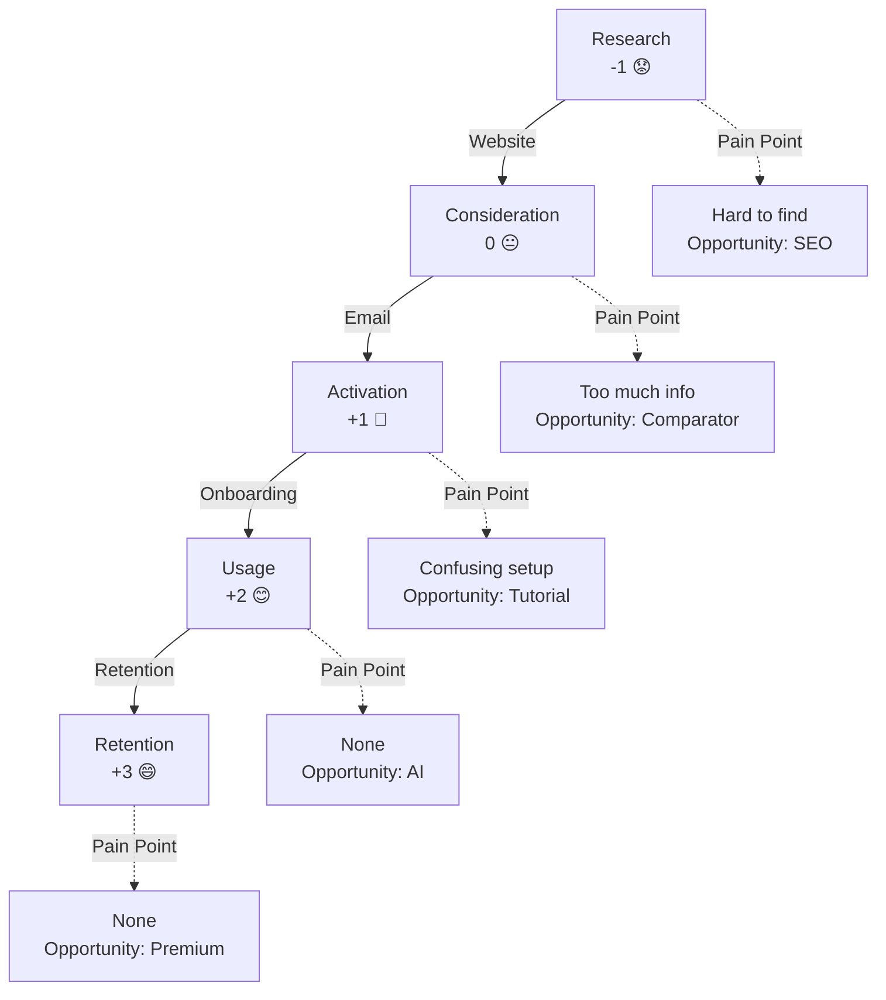

# User Journey Map Template

## Responsaveis

- **Owner:** Design Lead
- **Contribuem:** PM, Growth, User Research
- **Aprovacao:** PM + Design Lead

## Personas (Based on Product Vision)

### [Persona 1: Name]
- **Background:** Professional/personal context
- **Primary Goal:** What they want to achieve
- **Challenges:** Problems they face
- **Technology:** Familiarity, devices
- **Motivation:** What drives them

### [Persona 2: Name]
- **Background:** Professional/personal context
- **Primary Goal:** What they want to achieve
- **Challenges:** Problems they face
- **Technology:** Familiarity, devices
- **Motivation:** What drives them

---

## Journey Maps by Persona

### Persona 1: [Name] - [Scenario]

#### Journey Stages

| Stage | Action | Thought | Emotion | Pain Point | Opportunity |
|-------|--------|---------|---------|-----------|---|
| **Research** | How do they discover the product? | "I need to find a solution..." | -1 (frustrated) | Hard to find information | Improve SEO, educational content |
| **Consideration** | Compare options | "Does this solve my problem?" | 0 (neutral) | Too much conflicting information | Comparator, testimonials, case studies |
| **Activation** | Create account and start | "I'll try it" | +1 (hopeful) | Confusing onboarding | Simplify setup, interactive tour |
| **Usage** | Execute main tasks | "This works well" | +2 (confident) | None | Smart suggestions, shortcuts |
| **Retention** | Continuous usage | "It's my go-to tool" | +3 (satisfied) | None | Loyalty programs |

#### Touchpoints

| Touchpoint | Type | Device | Objective | Status |
|-----------|------|--------|---------|--------|
| Main website | Page | Desktop/Mobile | Discover product | Primary |
| Blog posts | Page | Desktop/Mobile | Education | Secondary |
| Onboarding email | Email | Desktop | Guide first steps | Primary |
| In-app tooltips | Modal | Desktop/Mobile | Educate during action | Primary |
| Support chat | Integration | Desktop/Mobile | Resolve questions | Secondary |

#### Emotion Curve

```
Emotion throughout the journey:

  +3  ┌─────────────┐ Retention (satisfied)
      │             │
  +2  │    Usage    │ (confident)
      │   /    \    │
  +1  │  /      \   │ Activation (hopeful)
      │ /        \  │
   0  ├─────────────┤ Consideration (neutral)
      │             │
  -1  │ Research    │ (frustrated)
```

#### Key Moments of Truth (Critical Moments)

1. **First Impression** (Research)
   - When: First website visit
   - Risk: Leaves without understanding value
   - Opportunity: Clear copy, hero visual, strong CTA

2. **Onboarding Success** (Activation)
   - When: Completes first workflow
   - Risk: Abandonment due to confusion
   - Opportunity: Step-by-step tutorial, shortcuts

3. **First Meaningful Result** (Usage)
   - When: Gets expected result
   - Risk: Doesn't see value yet
   - Opportunity: Celebrate success, next actions

---

### Persona 2: [Name] - [Scenario]

#### Journey Stages

| Stage | Action | Thought | Emotion | Pain Point | Opportunity |
|-------|--------|---------|---------|-----------|---|
| **Research** | ... | ... | ... | ... | ... |
| **Consideration** | ... | ... | ... | ... | ... |
| **Activation** | ... | ... | ... | ... | ... |
| **Usage** | ... | ... | ... | ... | ... |
| **Retention** | ... | ... | ... | ... | ... |

#### Touchpoints

| Touchpoint | Type | Device | Objective | Status |
|-----------|------|--------|---------|--------|
| ... | ... | ... | ... | ... |

#### Key Moments of Truth

1. **[Moment 1]** ([Stage])
   - When: ...
   - Risk: ...
   - Opportunity: ...

---

## Touchpoint Inventory

### By Type

**Web Pages**
- Homepage
- Product pages
- Pricing
- Blog
- Documentation
- Support center

**In-App**
- Onboarding flow
- Main dashboard
- Feature workflows
- Settings
- Help/tooltips

**Communication**
- Email (onboarding, updates, support)
- Push notifications
- Chat support
- In-app messages

**Integrations**
- API
- Webhooks
- OAuth/SSO
- Synchronizations

### By Priority

| Priority | Touchpoints | Reason |
|-----------|-----------|-------|
| **CRITICAL** | ... | First experience, core task |
| **HIGH** | ... | Frequent use, direct impact |
| **MEDIUM** | ... | Support, context |
| **LOW** | ... | Nice-to-have, future |

---

## Journey Map (Mermaid)



---

## Alignment with User Stories

| Journey Stage | User Stories | Features (PRD-F-#) |
|---------------|-------------|-------------------|
| Research | US-1, US-2 | PRD-F-1 (Homepage), PRD-F-3 (SEO) |
| Consideration | US-3, US-4 | PRD-F-2 (Pricing), PRD-F-4 (Comparator) |
| Activation | US-5, US-6 | PRD-F-5 (Onboarding) |
| Usage | US-7, US-8, US-9 | PRD-F-6 (Core Features) |
| Retention | US-10 | PRD-F-7 (Premium) |

---

## Opportunities Identified

### New Features

- **[Opportunity 1]** (Persona X, stage Y)
  - Problem: ...
  - Solution: ...
  - Impact: Increase retention by X%

### Existing Improvements

- **[Improvement 1]** (Persona X, touchpoint Y)
  - Problem: ...
  - Solution: ...
  - Impact: Reduce churn by X%

### Required Content

- **[Content 1]** (Stage X)
  - Type: Blog, tutorial, webinar
  - Objective: Help persona X understand Y
  - Metric: X conversions

---

## Notes and Next Steps

- [ ] Validate journeys with real users
- [ ] Conduct usability testing
- [ ] Measure success of each stage
- [ ] Iterate with analytics data

## O que fazer / O que nao fazer

**O que fazer:**
- Mapear emocao em cada touchpoint (positivo/neutro/negativo)
- Vincular steps a PRD-F-# para rastreabilidade
- Incluir edge cases com paths de recuperacao
- Cobrir 100% dos PRD-F-# Must Have em pelo menos 1 JOUR-#

**O que nao fazer:**
- Nao criar jornadas sem persona definida
- Nao ignorar momentos de frustracao (eles revelam oportunidades)
- Nao copiar user stories como steps (jornada e perspectiva do usuario)
- Nao pular edge cases — dev precisa deles para implementar

