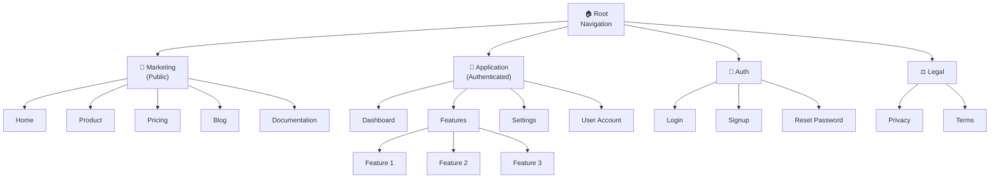

# UX Sitemap Template

## Responsaveis

- **Owner:** Design Lead
- **Contribuem:** PM, Frontend Dev
- **Aprovacao:** PM + Design Lead

## Information Architecture

### Hierarchical Structure

### Page Categories

**Core Application**
- Main dashboard
- Feature workflows
- User workspace
- Reports/Analytics

**Marketing & Onboarding**
- Homepage
- Product pages
- Pricing
- Case studies
- Blog

**Account Management**
- Profile
- Settings
- Subscription
- Billing
- Integrations

**Utility**
- 404 error
- Maintenance
- Offline mode
- Help/Support

**Legal & Meta**
- Privacy Policy
- Terms of Service
- Security
- Accessibility

---

## Page Inventory

| Page | Description | Parent | Level | Access | Devices | Related Features |
|--------|-----------|--------|-------|--------|-------------|----------------------|
| **Marketing** | | | | | | |
| `/` | Homepage | - | Root | Public | Desktop/Mobile | PRD-F-1 |
| `/product` | Product description | Home | 2 | Public | Desktop/Mobile | PRD-F-1 |
| `/pricing` | Pricing plans table | Home | 2 | Public | Desktop/Mobile | PRD-F-7 |
| `/blog` | Blog | Home | 2 | Public | Desktop/Mobile | - |
| `/blog/[slug]` | Individual post | Blog | 3 | Public | Desktop/Mobile | - |
| `/docs` | Knowledge base | Home | 2 | Public | Desktop | - |
| `/docs/[slug]` | Article | Docs | 3 | Public | Desktop | - |
| | | | | | | |
| **Authentication** | | | | | | |
| `/login` | Login | - | Root | Public | Desktop/Mobile | PRD-F-2 |
| `/signup` | Create account | - | Root | Public | Desktop/Mobile | PRD-F-2 |
| `/reset-password` | Reset password | - | Root | Public | Desktop/Mobile | PRD-F-2 |
| `/verify-email` | Verification | - | Root | Public | Desktop/Mobile | PRD-F-2 |
| | | | | | | |
| **Application Core** | | | | | | |
| `/app` | Dashboard | - | Root | Authenticated | Desktop/Mobile | PRD-F-3, PRD-F-4 |
| `/app/feature1` | Feature 1 workspace | App | 2 | Authenticated | Desktop/Mobile | PRD-F-3 |
| `/app/feature1/[id]` | Feature 1 detail | Feature1 | 3 | Authenticated | Desktop/Mobile | PRD-F-3 |
| `/app/feature2` | Feature 2 workspace | App | 2 | Authenticated | Desktop/Mobile | PRD-F-4 |
| `/app/reports` | Reports | App | 2 | Authenticated | Desktop | PRD-F-5 |
| | | | | | | |
| **Account** | | | | | | |
| `/app/account` | User profile | App | 2 | Authenticated | Desktop/Mobile | PRD-F-6 |
| `/app/account/settings` | Settings | Account | 3 | Authenticated | Desktop/Mobile | PRD-F-6 |
| `/app/account/subscription` | Subscription | Account | 3 | Authenticated | Desktop | PRD-F-7 |
| `/app/account/billing` | Billing history | Account | 3 | Authenticated | Desktop | PRD-F-7 |
| `/app/account/integrations` | Integrations | Account | 3 | Authenticated | Desktop | PRD-F-8 |
| | | | | | | |
| **Utility** | | | | | | |
| `/404` | Not found | - | Utility | Public | Desktop/Mobile | - |
| `/maintenance` | Maintenance page | - | Utility | Public | Desktop/Mobile | - |
| | | | | | | |
| **Legal** | | | | | | |
| `/privacy` | Privacy | - | Legal | Public | Desktop/Mobile | - |
| `/terms` | Terms | - | Legal | Public | Desktop/Mobile | - |

---

## Navigation Patterns

### Primary Navigation (Main Navigation)

**Location:** Header/Top bar (desktop), Hamburger menu (mobile)

**Items:**
- Logo (returns to home)
- Marketing (Home, Product, Pricing)
- Blog
- Docs
- CTA (Login / Dashboard if authenticated)

**Mobile:** Collapse into hamburger, drawer navigation

### Secondary Navigation (Within App)

**Location:** Left sidebar (desktop), Bottom tabs (mobile)

**Items:**
- Dashboard
- Feature 1
- Feature 2
- Reports
- Settings (gear icon)

**Pattern:** Active state highlighted, icon + text

### Breadcrumb Navigation

**Pages that display:**
- `/app/feature1/[id]` → Dashboard > Feature 1 > [Title]
- `/docs/[slug]` → Docs > [Category] > [Title]
- `/blog/[slug]` → Blog > [Category] > [Title]

**Pattern:** " / " separator, last item without link

### Footer Navigation

**Items:**
- Legal links (Privacy, Terms)
- Social links
- Newsletter signup
- Copyright

---

## URL Structure

### Conventions

- **Lowercase:** `/app/my-feature` (not `/App/MyFeature`)
- **Hyphens:** `/my-article` (not `/my_article`)
- **No trailing slash:** `/docs/api` (not `/docs/api/`)
- **IDs as UUID:** `/app/feature1/550e8400-e29b-41d4-a716-446655440000`
- **Query params:** `/app/feature1?sort=date&filter=active`

### Patterns by Type

**Marketing:**
- Homepage: `/`
- Page: `/[page-slug]`
- Blog post: `/blog/[slug]`
- Documentation: `/docs/[category]/[slug]` or `/docs/[slug]`

**Application:**
- Root: `/app`
- Feature: `/app/[feature-name]`
- Detail: `/app/[feature-name]/[id]`
- Sub-action: `/app/[feature-name]/[id]/[action]`

**Auth:**
- Login: `/login`
- Signup: `/signup`
- Reset: `/reset-password`
- Verify: `/verify-email?token=[token]`

**Account:**
- Profile: `/app/account`
- Settings: `/app/account/settings`
- Subscription: `/app/account/subscription`

---

## Access Levels

| Level | Description | Example | Redirects if not authenticated |
|-------|-----------|---------|------|
| **Public** | Access without login | Home, Pricing, Blog | - |
| **Authenticated** | Requires login | Dashboard, Features | `/login?next=[page]` |
| **Admin** | Requires admin role | Admin panel | `/login?next=[page]` |
| **Editor** | Requires editor role | Content management | `/login?next=[page]` |

---

## Mobile Considerations

### Responsive Breakpoints

- **Mobile:** <640px (single column, bottom nav)
- **Tablet:** 640px-1024px (2 column, side nav)
- **Desktop:** >1024px (3 column, top nav)

### Mobile Navigation

- **Primary:** Bottom tab bar (5 items max)
- **Secondary:** Expand/collapse sections
- **Tertiary:** Slide-out drawer
- **Avoid:** Hover states, complex dropdowns

### Touch-Friendly

- Minimum 44x44px tap targets
- Don't rely on hover
- Support gestures (swipe, pull-to-refresh)

---

## Flow Validation

### Persona 1 - [Name]

**Journey: Research → Activation → Usage**

- Research: Home → Product → Pricing → Signup ✓ (3 clicks to conversion)
- Activation: Signup → Verify email → Onboarding → Dashboard ✓
- Usage: Dashboard → Feature1 → Feature1 detail ✓ (2 clicks)

### Persona 2 - [Name]

**Journey: Consideration → Activation → Retention**

- Consideration: Home → Blog → Docs → Pricing ✓
- Activation: Signup → Onboarding → Dashboard ✓
- Retention: Dashboard → Reports → Settings ✓

---

## Notes and Next Steps

- [ ] Validate IA with card sorting test with users
- [ ] Define navigation prototype
- [ ] Create wireframes for each page
- [ ] Implement navigation tracking for analysis

## O que fazer / O que nao fazer

**O que fazer:**
- Organizar hierarquia por modelo mental do usuario (nao por backend)
- Incluir todas as telas publicas e autenticadas
- Documentar navegacao primaria e secundaria
- Vincular telas a JOUR-# steps

**O que nao fazer:**
- Nao criar hierarquia >4 niveis de profundidade
- Nao organizar pelo modelo de dados (usuario pensa diferente)
- Nao esquecer telas de erro, empty states, e onboarding
- Nao duplicar telas que servem multiplos contextos

