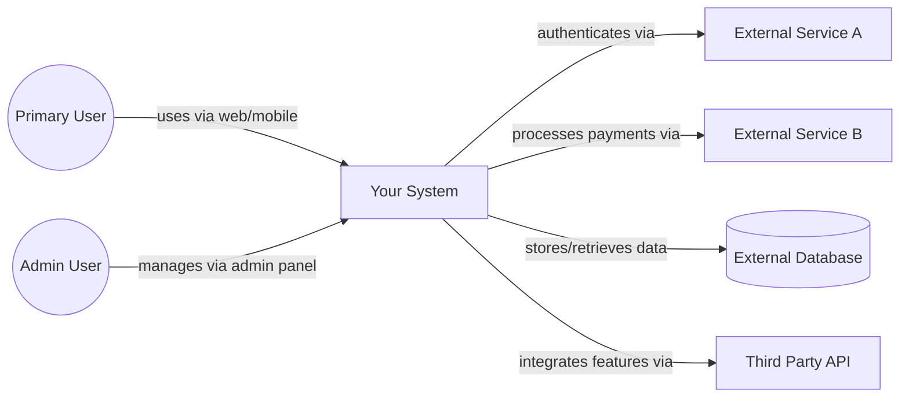
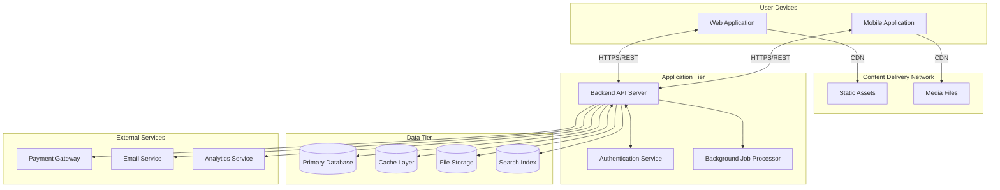
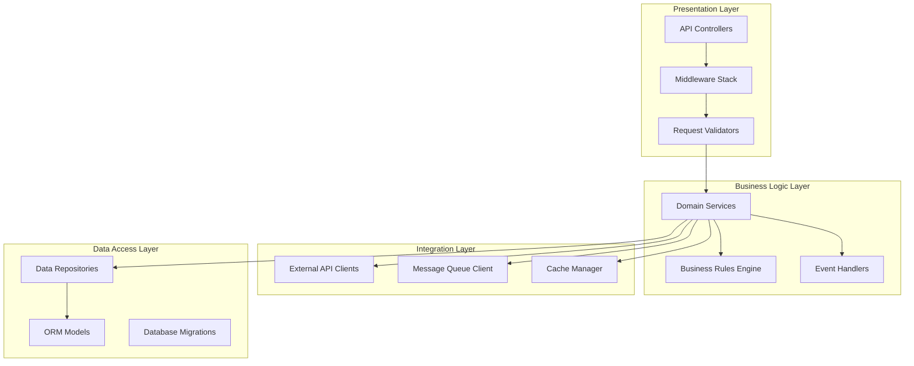
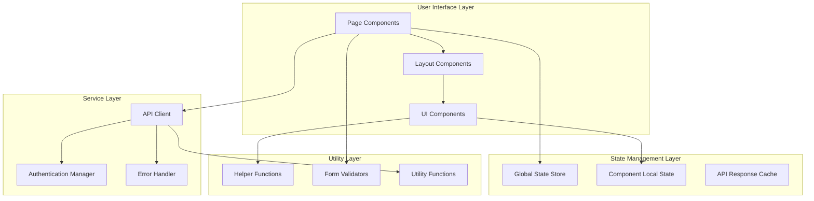
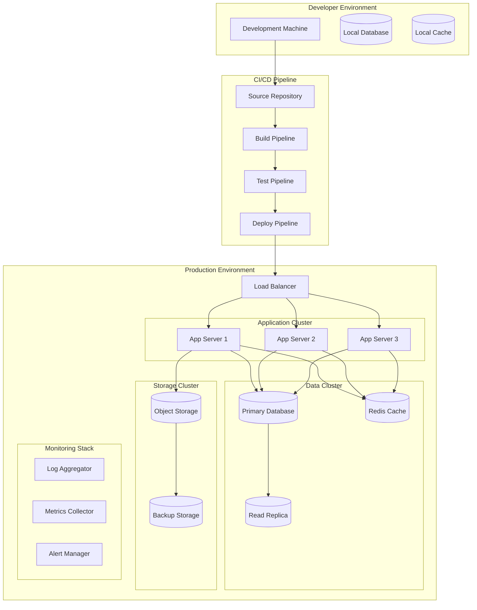
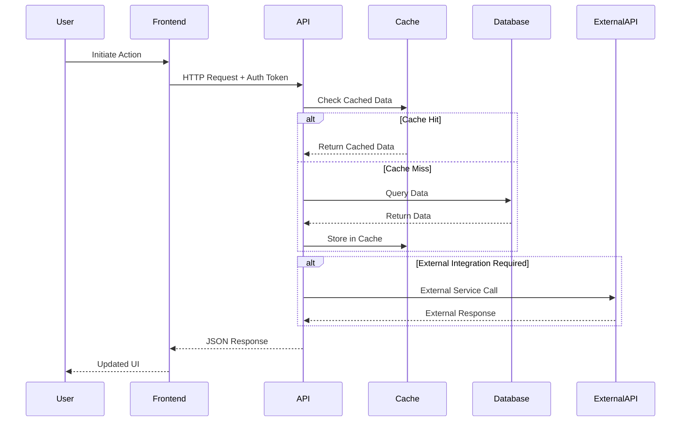
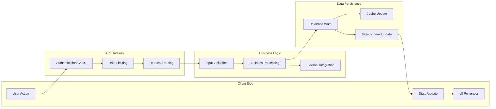
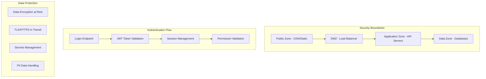
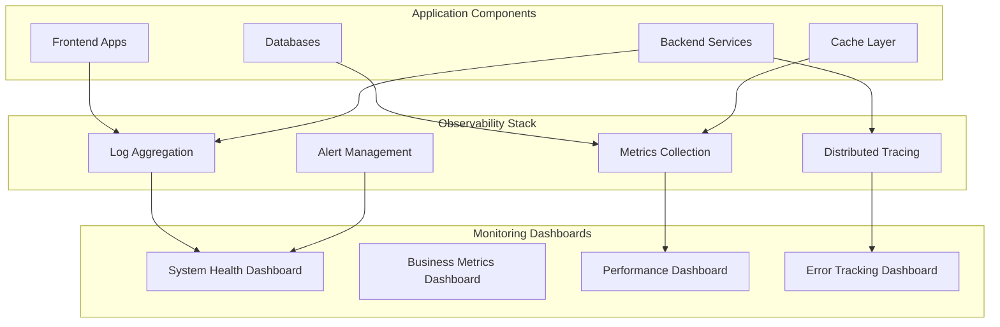
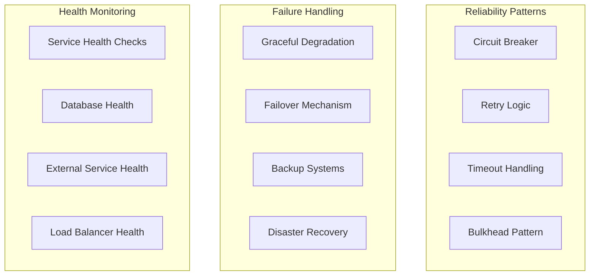

---
doc_meta:
  id: arch
  display_name: Architecture Diagram
  pillar: Build
  owner_role: Solution Architect
  summary: Captures C4 context, container, and deployment views for the solution.
  order: 10
  gate: technical
  requires:
  - srs
  optional:
  - frd
  feeds:
  - tech
uuid: <UUID>
version: 0.1.0
status: Draft
owners:
- <owner>
product: <product>
namespace: <namespace>
created: <YYYY-MM-DD>
last_updated: <YYYY-MM-DD>
tags:
- Architecture
- C4
- ETUS
ai_template_variables:
- product
- owner
- namespace
---

# Solo Architecture Diagram - [System Name]

**Author:** [Your Name]  
**Date:** [YYYY-MM-DD]  
**Context:** SOLO - Single developer project

---

## Document Control

- **Version:** 1.0
- **Status:** [Draft/Review/Approved]
- **Last Updated:** [Date]
- **Diagram Tool:** [Selected tool with rationale]
- **Notation Standard:** [C4/UML/Custom with rationale]

## Background

**Context:** [Background information about the system architecture]
**Architectural Goals:** [Primary objectives for the system design]
**Visual Strategy:** [Approach to representing complex system relationships]
**Non-Goals:** [What architectural aspects are excluded from visual representation]

## Scope Guard

- Owns: visual system architecture through multiple diagram types, system boundary and relationship visualization, deployment topology representation, cross-cutting concern visualization, architectural pattern illustration.
- Not included here: detailed component implementation specifications, specific technology configuration details, business process workflows, user interface mockups.

## 🧭 Visual Architecture Strategy

### Diagram Tool Selection

**Selected Diagram Tool:**

- **Selection Criteria:** [Maintainability, version control, team collaboration, rendering quality]
- **Chosen Tool:** [Mermaid/PlantUML/Draw.io/Other with rationale]
- **Notation Standard:** [C4/UML/Custom with rationale]
- **Integration Strategy:** [How diagrams integrate with documentation workflow]

**Visual Design Philosophy:**

- **Consistency:** [Standardized symbols, colors, and layout patterns]
- **Clarity:** [Information hierarchy and visual focus strategies]
- **Completeness:** [Coverage across all architectural perspectives]
- **Cross-Reference:** [How diagrams connect to detailed specifications]

### Architecture Visualization Framework

**System Overview:**

- **System Name:** [Your application/tool]
- **Architectural Purpose:** [High-level system goals and boundaries]
- **Key Stakeholders:** [Primary audience for these architectural diagrams]
- **Complexity Level:** [Simple/Moderate/Complex with visualization approach]

**Diagram Categories:**

- **Context Diagrams:** System boundaries and external relationships
- **Container Diagrams:** Major system components and their interactions
- **Component Diagrams:** Internal structure and detailed relationships
- **Integration Diagrams:** API flows and external service connections
- **Deployment Diagrams:** Infrastructure and deployment topology
- **Data Flow Diagrams:** Information flow and transformation patterns

## 🌍 System Context Architecture

### Context Diagram

**Context Analysis:**

- **System Boundaries:** [Clear definition of what's inside vs outside the system]
- **User Types:** [Primary users, admin users, API consumers]
- **External Dependencies:** [Third-party services, databases, APIs]
- **Integration Points:** [How external services connect and authenticate]

**Cross-References:**

- **Detailed User Specifications:** See per and jour
- **External Integration Details:** See be integration architecture
- **Authentication Flows:** See tech security architecture

## 🧱 System Container Architecture

### Container Diagram

**Container Specifications:**

**Client Tier:**

- **Web Application:** [Selected framework, deployment strategy, caching approach]
- **Mobile Application:** [Native/hybrid approach, platform strategy, offline capabilities]

**Infrastructure Tier:**

- **CDN:** [Content delivery strategy, geographic distribution, cache policies]
- **Load Balancer:** [High availability strategy, traffic distribution, health checks]

**Application Tier:**

- **Backend API:** [Selected technology stack, scaling approach, service architecture]
- **Authentication Service:** [Auth strategy, token management, session handling]
- **Background Jobs:** [Async processing, queue management, job scheduling]

**Data Tier:**

- **Primary Database:** [Database technology, scaling strategy, backup approach]
- **Cache Layer:** [Caching strategy, invalidation policies, performance optimization]
- **File Storage:** [Storage solution, CDN integration, backup strategy]
- **Search Index:** [Search technology, indexing strategy, query optimization]

**Cross-References:**

- **Frontend Implementation:** See fe for detailed client architecture
- **Backend Implementation:** See be for detailed API architecture
- **Technology Decisions:** See tech for technology selection rationale

## 🧩 Component Architecture Details

### Backend Component Diagram

### Frontend Component Diagram

**Component Responsibilities:**

**Backend Components:**

- **API Controllers:** HTTP request handling, response formatting, routing
- **Middleware Stack:** Authentication, logging, CORS, rate limiting
- **Domain Services:** Core business logic, workflow orchestration
- **Repositories:** Data access patterns, query optimization
- **External Clients:** Third-party API integration, error handling

**Frontend Components:**

- **Page Components:** Route-level components, layout orchestration
- **UI Components:** Reusable interface elements, interaction handling
- **Global Store:** Application state, cross-component data sharing
- **API Client:** HTTP communication, request/response processing

**Cross-References:**

- **Detailed Component Specs:** See fe and be
- **Business Logic Details:** See frd for domain rules
- **Data Models:** See data for entity relationships

## 🚀 Deployment Architecture

### Infrastructure Topology

### Environment Strategy

**Development Environment:**

- **Local Setup:** [Development stack, database seeding, testing tools]
- **Development Workflow:** [Code changes, local testing, integration points]
- **Data Management:** [Test data, schema changes, migration testing]

**Staging Environment:**

- **Production Mirror:** [How staging mirrors production configuration]
- **Integration Testing:** [Full system testing, external service integration]
- **Performance Testing:** [Load testing, performance validation]

**Production Environment:**

- **High Availability:** [Multi-zone deployment, failover strategies]
- **Scaling Strategy:** [Auto-scaling rules, load balancing, capacity planning]
- **Security Configuration:** [Network security, access controls, encryption]

**Deployment Strategy:**

- **Deployment Pattern:** [Blue-green/Rolling/Canary deployment approach]
- **Rollback Strategy:** [Quick rollback procedures, database rollback considerations]
- **Monitoring Integration:** [Deployment monitoring, health checks, alerting]

**Cross-References:**

- **Infrastructure Details:** See tech infrastructure architecture section
- **Security Configuration:** See tech security architecture
- **Performance Requirements:** See tech performance specifications

## 🔄 System Integration Architecture

### Critical Data Flow Patterns

### API Integration Flow

**Critical Path Analysis:**

- **User Authentication Flow:** Login, token validation, session management
- **Core Business Operations:** Primary user workflows, data processing
- **External Service Integration:** Payment processing, email notifications
- **Real-time Updates:** WebSocket connections, live data synchronization

**Performance Considerations:**

- **Caching Strategy:** Multi-level caching, cache invalidation patterns
- **Database Optimization:** Query optimization, connection pooling
- **Async Processing:** Background jobs, event-driven updates

**Cross-References:**

- **Detailed API Specifications:** See be API architecture
- **Frontend Integration:** See fe integration patterns
- **Data Flow Details:** See data for detailed data flows

## 🔐 Cross-Cutting Architecture Concerns

### Security Architecture

### Observability Architecture

### Reliability Architecture

**Cross-Cutting Implementation Strategy:**

**Security Implementation:**

- **Authentication Boundaries:** [Clear security zones and access controls]
- **Data Protection:** [Encryption at rest and in transit, PII handling]
- **Secrets Management:** [API key management, environment variable security]
- **Least Privilege:** [Role-based access control, minimal permissions]

**Observability Implementation:**

- **Logging Strategy:** [Structured logging, log levels, retention policies]
- **Metrics Collection:** [Business metrics, system metrics, custom metrics]
- **Distributed Tracing:** [Request tracing, performance bottleneck identification]
- **Alerting Rules:** [Critical alerts, warning thresholds, escalation procedures]

**Reliability Implementation:**

- **Resilience Patterns:** [Circuit breakers, retries, timeouts, bulkheads]
- **Failure Recovery:** [Graceful degradation, automatic recovery, manual procedures]
- **Health Monitoring:** [Proactive health checks, dependency monitoring]
- **Disaster Recovery:** [Backup procedures, recovery time objectives]

**Performance Implementation:**

- **Caching Strategy:** [Multi-level caching, cache invalidation, performance optimization]
- **Database Optimization:** [Query optimization, indexing strategy, connection pooling]
- **Async Processing:** [Background job processing, event-driven architecture]

**Cross-References:**

- **Security Details:** See tech security architecture
- **Performance Specifications:** See tech performance requirements
- **Monitoring Implementation:** See tech observability strategy

## ⚠️ Architectural Assumptions & Constraints

### Technology Assumptions

- **Infrastructure Assumptions:** [Cloud provider capabilities, service availability, pricing models]
- **Performance Assumptions:** [Expected load patterns, user growth, geographic distribution]
- **Integration Assumptions:** [External service reliability, API stability, data format consistency]
- **Team Assumptions:** [Development expertise, operational capabilities, maintenance capacity]

### Technical Constraints

- **Budget Constraints:** [Infrastructure costs, licensing fees, service limits]
- **Time Constraints:** [Development timeline, migration deadlines, go-live dates]
- **Compliance Constraints:** [Regulatory requirements, security standards, data residency]
- **Legacy Constraints:** [Existing system integration, data migration, backward compatibility]

### Architectural Decisions

- **Technology Selection Rationale:** [Key technology choices and decision criteria]
- **Trade-off Decisions:** [Performance vs. complexity, cost vs. scalability]
- **Future Evolution Strategy:** [How architecture can adapt to changing requirements]
- **Risk Mitigation:** [Identified risks and architectural responses]

### Validation Criteria

- **Performance Criteria:** [Latency targets, throughput requirements, scalability benchmarks]
- **Reliability Criteria:** [Uptime targets, error rate thresholds, recovery time objectives]
- **Security Criteria:** [Threat model validation, compliance verification, penetration testing]
- **Maintainability Criteria:** [Code quality standards, documentation requirements, operational procedures]

## 🧪 Architecture Validation Framework

### Diagram Completeness Validation

**System Representation:**

- [ ] All external dependencies and integrations represented in context diagrams
- [ ] All major system containers and their relationships documented
- [ ] All critical components and their interactions visualized
- [ ] All data stores, caches, and persistent storage shown
- [ ] All asynchronous processing and queue systems included

**Architecture Quality Validation:**

- [ ] Security boundaries clearly identified across all diagrams
- [ ] Performance bottlenecks and optimization points visible
- [ ] Scalability patterns and constraints documented
- [ ] Failure points and resilience patterns illustrated
- [ ] Cross-cutting concerns consistently represented

**Implementation Guidance Validation:**

- [ ] Diagrams provide clear implementation direction
- [ ] Technology selection rationale visually apparent
- [ ] Integration patterns support development workflow
- [ ] Deployment strategy supports operational requirements
- [ ] Monitoring and observability architecture complete

### Cross-Reference Validation

**Template Integration:**

- [ ] Architecture aligns with tech technology decisions
- [ ] Backend diagrams match be specifications
- [ ] Frontend diagrams align with fe architecture
- [ ] Data architecture consistent with data models
- [ ] Security architecture matches tech security requirements

**Stakeholder Communication:**

- [ ] Diagrams effectively communicate to development team
- [ ] Architecture complexity appropriate for project scope
- [ ] Visual elements support non-technical stakeholder understanding
- [ ] Implementation guidance clear for solo development context
- [ ] Future evolution path apparent from architectural choices

### Architecture Evolution Tracking

**Change Management:**

- [ ] Version control strategy for diagram updates established
- [ ] Change impact assessment process defined
- [ ] Architecture decision record linkage maintained
- [ ] Team communication process for architectural changes
- [ ] Regular architecture review schedule established

---

**Implementation Notes:**

**Visual Architecture Standards:**

- Maintain consistent notation and styling across all diagrams
- Ensure visual elements clearly represent system boundaries and relationships
- Update diagrams immediately when architectural decisions change
- Use cross-references to connect visual elements with detailed specifications

**Technology Integration Guidelines:**

- Select diagram tools that integrate with development workflow
- Ensure diagrams can be version-controlled alongside code
- Choose notation standards that team members can easily understand and maintain
- Consider automated diagram generation where appropriate

---

- Reference arch for visual understanding of system structure and relationships
