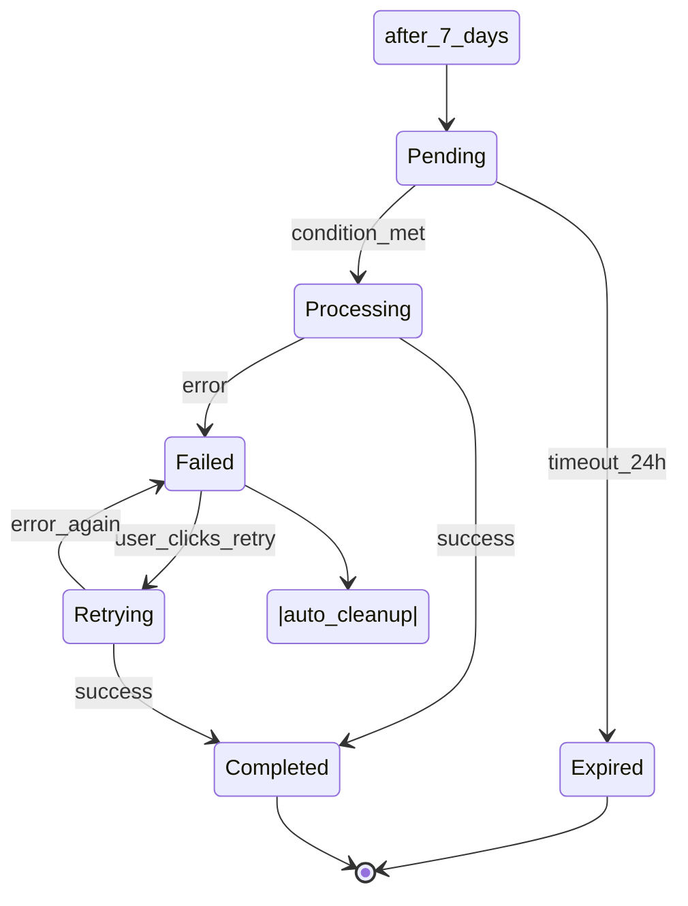

---
doc_meta:
  id: fs
  display_name: Feature Specification
  pillar: Define
  owner_role: Product Lead / Tech Lead
  summary: Detailed specification for complex features with >3 business rules or state machines. Decomposed from PRD features, complements user stories with inputs/outputs and business logic.
  order: 4
  gate: planning
  requires:
  - prd
  - stor
  optional: []
  feeds:
  - arch
  - data
  - be
  - fe
uuid: <UUID>
version: 1.0.0
status: Draft
owners:
- <owner>
product: <product>
namespace: <namespace>
created: <YYYY-MM-DD>
last_updated: <YYYY-MM-DD>
tags:
- Feature Spec
- Requirements
- ETUS
ai_template_variables:
- product
- owner
- namespace
---

# Feature Specification — [Feature Name]

**Author:** [Your Name] · **Date:** [YYYY-MM-DD]

**Feature Spec ID:** fs-[kebab-case-feature-name]

> **Owner:** Detailed business logic, inputs/outputs, state transitions for complex features.
> **NOT:** Acceptance criteria (User Stories own those), NFRs (SRS owns those), UX pixels (Frontend owns those).
> **Triggers:** This spec is needed when feature has >3 distinct business rules OR requires state machine. Otherwise, user story suffices.

---

## 0) Feature Context

### Link to Product Requirements

**PRD Feature:** PRD-F-# ([Feature Name from PRD])

See PRD for high-level feature description and success criteria.

### Link to User Stories

**Stories implementing this feature:** US-#, US-#, US-#

See User Stories for acceptance criteria and scenarios.

### Complexity Justification

**Why this feature needs detailed spec:**

- [ ] **Business rules:** This feature has >3 distinct rules that need detailed documentation
  - Rule categories: [List which types: validation, transformation, calculation, constraint, state, authorization, temporal]

- [ ] **State machine:** This feature has multiple states and conditional transitions
  - States: [List state names: e.g., pending, processing, completed, failed]
  - Transitions: [Describe conditional flow]

- [ ] **Data complexity:** This feature involves complex data transformations or relationships
  - Inputs/outputs: [Describe complexity]

- [ ] **Integration complexity:** This feature coordinates multiple systems or endpoints
  - Systems: [List integration points]

**Decision:** This feature requires FS-[name] spec because [reason]. Simpler features → story suffices.

---

## 1) Inputs (Detailed)

What data is required to execute this feature?

### Input Parameter 1: [Parameter Name]

- **Type:** String | Integer | Boolean | Object | Array | UUID | Enum | Date
- **Required:** Yes / No
- **Constraints:**
  - Length: [min-max] characters
  - Format: [regex or description] (e.g., UUID format, ISO8601 date, email format)
  - Allowed values: [if enum]
  - Range: [if numeric, e.g., 0-100]
  - Validation rule: [specific check, e.g., "must be unique"]

- **Example:** [Concrete value]
  ```
  "example-value"
  ```

- **Default:** [If optional, what's the default?]

### Input Parameter 2: [Next Parameter]

[Repeat structure above]

### Input Example (Complete Payload)

```json
{
  "parameter_1": "value1",
  "parameter_2": 42,
  "nested_object": {
    "field_a": "string",
    "field_b": true
  },
  "array_parameter": ["item1", "item2"]
}
```

---

## 2) Outputs (Detailed)

What data is returned from this feature?

### Output Field 1: [Field Name]

- **Type:** String | Integer | Boolean | Object | Array | UUID | Enum | Date
- **Structure:** [If nested object or array]
  ```json
  {
    "nested_field_1": "type",
    "nested_field_2": "type"
  }
  ```

- **Conditions:** When is this field returned?
  - Always
  - Only on success
  - Only on specific error
  - Conditionally if [condition]

- **Example:** [Concrete value]

### Output Field 2: [Next Field]

[Repeat structure]

### Output Example (Success Response)

```json
{
  "id": "uuid",
  "status": "completed",
  "result": {
    "field_1": "value",
    "field_2": 123
  },
  "timestamp": "2026-03-13T14:30:00Z"
}
```

### HTTP Status Codes (if API-based)

- **200 OK:** Success condition
- **201 Created:** Resource created successfully
- **400 Bad Request:** Validation error (input constraints violated)
- **401 Unauthorized:** Authentication required
- **403 Forbidden:** Permission denied (authorization rule violated)
- **404 Not Found:** Resource doesn't exist
- **422 Unprocessable Entity:** Business rule violation
- **500 Internal Server Error:** Unexpected failure
- **503 Service Unavailable:** Service temporarily down

---

## 3) Business Rules (Categorized)

Detailed rules that govern feature behavior. Group by category.

### Validation Rules (Input Checks)

Rules that validate inputs before processing:

**BR-[number].[level] - [Rule Name]**
- **Description:** [What is being validated?]
- **Rule:** [Specific check]
  - Example: "Email must match pattern: ^[a-zA-Z0-9._%+-]+@[a-zA-Z0-9.-]+\.[a-zA-Z]{2,}$"
  - Example: "Amount must be between $0.01 and $999,999.99"
  - Example: "Username must be unique across all users"

- **Enforcement:** Client-side / Server-side / Both
- **Error Message:** [User-facing error, not technical]
  - Example: "Email address is not valid"
  - Example: "Username is already taken"

- **Test Case 1:**
  - Input: [Value that passes]
  - Expected: [Validation passes]

- **Test Case 2:**
  - Input: [Value that fails]
  - Expected: [Validation fails with message: "…"]

---

### Transformation Rules (Data Manipulation)

Rules that change data format or content:

**BR-[number].[level] - [Rule Name]**
- **Description:** [What transformation occurs?]
- **Applied When:** [Before validation? After? On input? On storage?]
- **Transformation Logic:**
  - Example: "Trim whitespace from email field"
  - Example: "Convert amount to cents (multiply by 100)"
  - Example: "Generate UUID for new record"
  - Example: "Normalize phone number to E.164 format"

- **Example:**
  - Input: `"  user@example.com  "`
  - Transformed to: `"user@example.com"`

---

### Calculation Rules (Formulas)

Rules involving mathematical computation:

**BR-[number].[level] - [Rule Name]**
- **Description:** [What is calculated?]
- **Formula:** [Mathematical expression]
  - Example: `total = subtotal * (1 + tax_rate) + shipping`
  - Example: `days_overdue = today - invoice_date`
  - Example: `confidence_score = (positive_signals / total_signals) * 100`

- **Precision:** [Decimal places, rounding]
  - Example: "Round to 2 decimal places (currency)"
  - Example: "Round down to nearest integer"

- **Test Case:**
  - Input: [Values]
  - Calculation: [Show work]
  - Result: [Expected output]

---

### Constraint Rules (Business Logic)

Rules enforcing business constraints:

**BR-[number].[level] - [Rule Name]**
- **Description:** [What constraint is enforced?]
- **Type:** Uniqueness | Referential Integrity | Cardinality | Range | Dependency
- **Rule:** [Specific constraint]
  - Example: "Email must be globally unique"
  - Example: "Invoice can only have one outstanding balance (must be settled or fully paid)"
  - Example: "User cannot create >10 projects in free tier"

- **Enforcement:** Database | Application | Both
- **Violation Response:** [What happens when violated?]
  - Example: HTTP 409 Conflict, message: "Invoice already processed"
  - Example: Database constraint error, user message: "Email already in use"

---

### State Rules (State Transitions)

Rules governing state changes and transitions:

**BR-[number].[level] - [Rule Name]**
- **Description:** [State transition rule]
- **Initial State:** `status = "pending"` (description)
- **Trigger:** [What action/event causes transition?]
  - Example: "User submits payment"
  - Example: "Payment processor webhook received"
  - Example: "48 hours elapsed"

- **Transition:** `pending` → `processing` (conditions)
  - **Condition 1:** If payment is valid → Set status to "processing"
  - **Condition 2:** If payment is invalid → Set status to "failed", emit error event

- **Side Effects:** [What else changes on transition?]
  - Example: "Send confirmation email"
  - Example: "Log event: ev.invoice.paid"
  - Example: "Trigger refund workflow"

- **Invalid Transitions:** [Blocked transitions]
  - Example: Cannot go from `completed` → `pending`
  - Example: Cannot skip `processing` state

- **Recovery Paths:** [Error recovery]
  - Example: If payment fails in `processing`, transition to `failed`, user can retry
  - Example: Timeout in `pending` after 24h → auto-transition to `expired`

- **Edge Cases:** [Unusual situations]
  - Example: Browser refresh during transition (idempotency)
  - Example: Network failure mid-transaction (retry logic)
  - Example: Concurrent requests (locking/ordering)

---

### Authorization Rules (Access Control)

Rules controlling who can do what:

**BR-[number].[level] - [Rule Name]**
- **Description:** [Permission requirement]
- **Required Permission:** [Role/permission name]
  - Example: `invoices.write`
  - Example: `admin:users`
  - Example: `owner_of_resource`

- **Who Can Perform:** [User types]
  - Example: "Invoice creator only"
  - Example: "Admin or invoice owner"
  - Example: "Any authenticated user"

- **Enforcement:** Middleware / Endpoint / Database
- **Violation Response:** HTTP 403 Forbidden, message: "You don't have permission"

---

### Temporal Rules (Time-Based)

Rules involving time constraints or schedules:

**BR-[number].[level] - [Rule Name]**
- **Description:** [Time-based constraint]
- **Rule:** [Temporal constraint]
  - Example: "Invoice reminder can be sent max 1x per 3 days"
  - Example: "Free trial expires after 14 days"
  - Example: "Webhook retry window: 24 hours with exponential backoff"

- **Enforcement:** Cron job / Scheduled service / Application logic
- **Action on Expiration:** [What happens when time expires?]
  - Example: "Trial → Premium signup required"
  - Example: "Stop retry attempts, log as failed"

---

## 4) State Transitions (State Machine)

If this feature has complex state flow, document it here:

### State Diagram

```
[Initial State]
    ↓
[Intermediate State] ← condition triggers
    ↓ (condition met)
[Success State]
    ↓
[Final State]

Recovery paths:
[Intermediate State] → [Error State] ← condition fails
[Error State] → [Intermediate State] (user can retry)
```

### State Definitions

| State | Meaning | Valid Next States | Entry Trigger | Exit Trigger |
| --- | --- | --- | --- | --- |
| `pending` | Awaiting action | processing, expired, cancelled | User initiates | Condition met |
| `processing` | In progress | completed, failed, retrying | Condition met | Completion/failure |
| `completed` | Success | [none - terminal] | All rules pass | — |
| `failed` | Error occurred | retrying, archived | Rule violation | User retries |
| `retrying` | Attempting again | completed, failed, expired | User or auto-retry | Retry succeeds/fails |

### State Transition Logic (Pseudocode)

```
Function handleFeature(input):
    // Initial state
    state = "pending"
    attempts = 0

    // Main flow
    If validateInput(input):
        state = "processing"

        Try:
            result = processFeature(input)
            state = "completed"
            return result
        Catch error:
            If error.retryable AND attempts < 3:
                state = "retrying"
                attempts += 1
                Retry after exponential backoff
            Else:
                state = "failed"
                Log error: ev.feature.failed
                Return error response
    Else:
        state = "invalid"
        Return validation error

    // Recovery (user can retry from failed)
    If state == "failed" AND userClicksRetry():
        state = "pending"
        Go back to Main flow
```

### Mermaid Diagram (if complex)



---

## 5) API Endpoint Hints (if applicable)

Details about HTTP API endpoints implementing this feature:

### Endpoint 1

- **Path:** `POST /api/v1/invoices/{invoice_id}/send-reminder`
- **Method:** POST (creates action)
- **Idempotent:** Yes / No (safe to retry? Yes = idempotent)
- **Authentication:** Required (JWT bearer) / Optional / Public
- **Authorization:** Requires permission: `invoices.write`, `owner_of_resource`
- **Rate Limiting:** 100 requests/minute per user
- **Timeout:** 30 seconds (client should timeout after 35s)

**Request Headers:**
```
Authorization: Bearer <jwt_token>
Content-Type: application/json
Idempotency-Key: <uuid> (optional but recommended for POST)
X-Request-ID: <uuid> (for tracing)
```

**Request Body Schema:**
```json
{
  "message": "string (optional, custom reminder text)",
  "send_copy_to_self": "boolean (optional, default false)"
}
```

**Success Response (200 OK):**
```json
{
  "id": "reminder-uuid",
  "invoice_id": "invoice-uuid",
  "status": "sent",
  "sent_at": "2026-03-13T14:30:00Z",
  "recipient": "client@example.com"
}
```

**Error Response (400 Bad Request):**
```json
{
  "error": "VALIDATION_ERROR",
  "message": "Invoice not found",
  "details": [
    {
      "field": "invoice_id",
      "error": "Invoice does not exist",
      "code": "INVOICE_NOT_FOUND"
    }
  ]
}
```

**Error Response (422 Unprocessable Entity - Business Rule):**
```json
{
  "error": "BUSINESS_RULE_VIOLATION",
  "message": "Cannot send reminder: invoice already paid",
  "rule_id": "BR-1.4",
  "details": {
    "invoice_status": "paid",
    "paid_date": "2026-03-10T00:00:00Z"
  }
}
```

---

## 6) Error Handling

What can go wrong and how is it handled?

### Error Type 1: [Error Category]

**Possible Errors:**
- Error code: ERROR_NAME (description)
- Error code: ANOTHER_ERROR (description)

**Retry Strategy:**
- Is it retryable? Yes / No
- If yes: Exponential backoff, max 3 retries, base delay 1s
  - Attempt 1: Wait 1s
  - Attempt 2: Wait 2s
  - Attempt 3: Wait 4s

**Fallback Behavior:**
- What happens after all retries fail?
- Example: Queue for async processing, notify user later
- Example: Fail fast, return error to user

**User Notification:**
- How does user learn about error?
- Tooltip? Error page? Email notification? Retry prompt?

---

## 7) Implementation Guidance (Optional, for P0 Features)

### Technology Recommendations

**Frontend:**
- [Framework/Library] (rationale: handles [specific requirement])

**Backend:**
- [Framework/Language] (rationale: good for [use case])

**Database:**
- [Storage choice] (rationale: [data model fit])

**Caching:**
- [Caching strategy] (rationale: improves [metric])

### Code Pattern Example

```typescript
// Pseudocode showing implementation approach
async function sendReminder(invoiceId: string): Promise<ReminderResult> {
  // Step 1: Validate input
  const invoice = await getInvoice(invoiceId);
  if (!invoice) {
    throw new NotFoundError("Invoice not found");
  }

  // Step 2: Check business rules
  if (invoice.status !== "unpaid") {
    throw new BusinessRuleError("Can only remind unpaid invoices");
  }

  if (!invoice.clientEmail) {
    throw new ValidationError("Client email missing");
  }

  // Step 3: Enforce temporal rule (cooldown)
  const lastReminder = await getLastReminder(invoiceId);
  if (lastReminder && daysElapsed(lastReminder) < 3) {
    throw new TemporalRuleError(`Can retry in ${3 - daysElapsed(lastReminder)} days`);
  }

  // Step 4: Execute with retry
  let attempts = 0;
  while (attempts < 3) {
    try {
      const result = await emailService.send({
        to: invoice.clientEmail,
        subject: `Payment reminder for invoice ${invoice.number}`,
        body: generateReminderEmail(invoice)
      });

      // Step 5: Update state and log
      await updateInvoice(invoiceId, { lastReminderSentAt: now() });
      await logEvent("ev.invoice.reminder_sent", { invoiceId, sentAt: now() });

      return { status: "sent", sentAt: now() };
    } catch (error) {
      attempts++;
      if (attempts < 3 && isRetryable(error)) {
        await sleep(exponentialBackoff(attempts));
      } else {
        throw error;
      }
    }
  }
}
```

### Performance Considerations

- **Target Latency:** <500ms (p95) for typical request
- **Throughput:** Support 1000 reminders/second peak
- **Scalability:** Horizontally scalable (stateless service)
- **Optimization Strategies:**
  - Batch email sending (group reminders per batch service call)
  - Cache invoice data (5min TTL, invalidate on update)
  - Async processing (return immediately, send email in background)

---

## 8) Testing Recommendations

### Unit Tests

Test each business rule in isolation:

- **BR-1.1 (Validation):** Test valid + invalid inputs
- **BR-2.1 (Calculation):** Test formula with edge cases
- **BR-3.1 (Constraint):** Test uniqueness, cardinality constraints
- **BR-4.1 (State):** Test valid transitions, block invalid ones
- **BR-5.1 (Authorization):** Test permission checks

### Integration Tests

Test features working with dependencies:

- API endpoint with database
- Email service integration
- State transitions with database updates
- Concurrent requests (race conditions)

### E2E Tests

Test complete user workflows:

- Happy path: User sends reminder, email delivered, invoice updated
- Error path: Email service down, retry succeeds
- Edge case: User sends 2 reminders quickly (cooldown enforcement)

### Performance Tests

- Load test with k6: 100 concurrent users, 10 requests/second
- Latency: P95 < 500ms
- Error rate: <0.1%

---

## ✅ Feature Spec Gate

Validate that detailed spec is complete and consistent:

- [ ] Complexity justified (>3 rules or state machine documented)
- [ ] All inputs defined (type, constraints, examples)
- [ ] All outputs defined (structure, conditions, status codes)
- [ ] Business rules categorized and complete
  - [ ] Validation rules: All inputs have constraints + error messages
  - [ ] Transformation rules: Clear when applied
  - [ ] Calculation rules: Formula + precision defined
  - [ ] Constraint rules: Enforcement location specified
  - [ ] State rules: Transitions, triggers, recovery documented
  - [ ] Authorization rules: Permissions clear
  - [ ] Temporal rules: Time windows + expiration actions defined
- [ ] State machine complete (if applicable)
  - [ ] All states defined
  - [ ] All valid transitions documented
  - [ ] Invalid transitions blocked
  - [ ] Recovery paths for errors
  - [ ] Edge cases addressed (timeout, concurrency, refresh)
- [ ] API endpoints documented (if applicable)
  - [ ] Request/response schemas with examples
  - [ ] HTTP status codes
  - [ ] Error response format
  - [ ] Authentication/authorization
- [ ] Error handling strategy defined
- [ ] Test recommendations cover unit/integration/E2E
- [ ] No gaps between spec and related user stories
- [ ] Confidence: Could engineer implement from this spec alone?

---

## References

### Upstream
- **prd** - Product Requirements (PRD-F-# feature context)
- **stor** - User Stories (acceptance criteria, scenarios)
- **vis** - Product Vision (problem context)

### Downstream
- **arch** - Architecture Diagram (system components supporting this feature)
- **srs** - Software Requirements (NFRs: performance, security, reliability)
- **data** - Data Model (entities, relationships, events)
- **be** - Backend Requirements (API endpoint details, OpenAPI spec)
- **fe** - Frontend Requirements (component specifications)

---

**End of Feature Specification**
