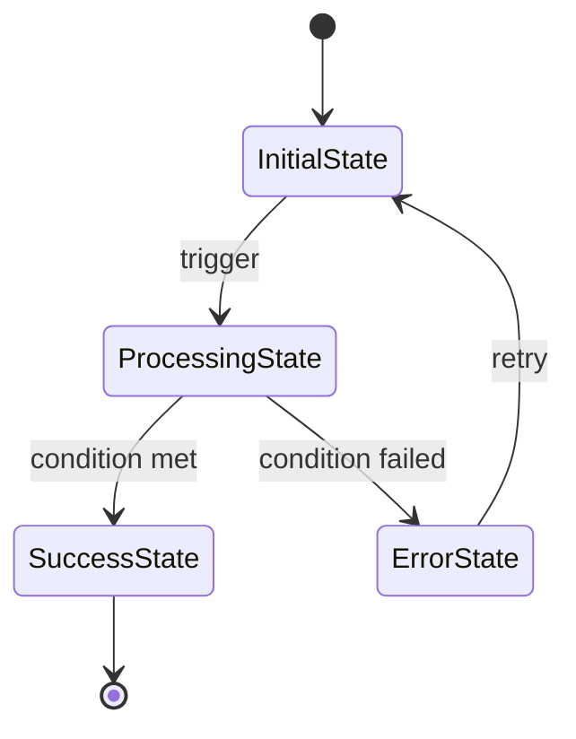

---
doc_meta:
  id: frd
  display_name: Feature Requirements Document
  pillar: Define
  owner_role: Product Lead
  summary: Decomposes PRD features (PRD-F-#) into detailed functional requirements (FR-#) with inputs, outputs, business rules, and state handling.
  order: 8
  gate: planning
  requires:
  - prd
  - stor
  optional: []
  feeds:
  - srs
  - be
  - fe
uuid: <UUID>
version: 1.0.0
status: Draft
owners:
- <owner>
product: <product>
namespace: <namespace>
created: <YYYY-MM-DD>
last_updated: <YYYY-MM-DD>
tags:
- FRD
- Feature Requirements
- ETUS
ai_template_variables:
- product
- owner
- namespace
---

# Feature Requirements Document — [Product Name]

**Author:** [Your Name]
**Date:** [YYYY-MM-DD]
**Context:** SOLO - Single developer project

> **Owner:** Decomposes PRD features (PRD-F-#) into detailed functional requirements (FR-#).
> **No** acceptance criteria here (User Stories own Given/When/Then). **No** NFRs here (SRS owns NFR-#). **No** problem validation here (Vision owns that).

---

## Scope Guard

- **Owns:** Functional decomposition of PRD features; detailed behavior per FR-#; inputs/outputs; business rules; state handling; FR-# → US-# traceability.
- **Not included:** Acceptance criteria (see User Stories), NFRs (see SRS), problem validation (see Vision), UX decisions (see UXDD), technical architecture (see Tech Spec).

---

## Journey Mapping (Optional)

**Journey References:** (if journey documentation exists)
- **JOUR-#:** Journey name (Steps X-Y use this FR)
- **JOUR-#:** Journey name (Steps A-B use this FR)

> **Note:** This section links functional requirements to user journeys. Include only if user journey documentation (JTBD/User Journey Maps) exists. Skip for backend-only or technical FRs.

---

## FR-# Index

**Traceability:** PRD-F-# → FR-# → US-#

| FR-# | Feature   | Title                              | Priority | Related Stories | Status |
|------|-----------|-----------------------------------|----------|----------------|--------|
| FR-1 | PRD-F-1   | [Functional requirement title]    | P0       | US-1, US-2     | Draft  |
| FR-2 | PRD-F-1   | [Functional requirement title]    | P0       | US-1           | Draft  |
| FR-3 | PRD-F-2   | [Functional requirement title]    | P1       | US-3           | Draft  |
| FR-4 | PRD-F-2   | [Functional requirement title]    | P1       | US-3, US-4     | Draft  |

---

## PRD-F-1: [Feature Name from PRD]

**Feature Context:** See prd PRD-F-1 for high-level feature definition and success criteria.
**User Stories:** US-1, US-2 implement this feature with acceptance criteria.

### FR-1: [Specific Functional Requirement Title]

**Description:** The system SHALL [detailed functional behavior that implements part of PRD-F-1]

**Journey Integration:** (if applicable to user-facing features)
- **Primary Journey:** JOUR-# (Journey name)
- **Journey Steps:** Steps X-Y (specific workflow)
- **User Intent:** What user is trying to accomplish
- **Entry Point:** Where/how user enters this functionality
- **Exit Point:** Where user goes after completion
- **Preconditions:**
  - System state required before FR executes
  - User permissions/authentication needed
  - Data dependencies
- **Postconditions:**
  - Guaranteed system state after FR completes
  - Data changes made
  - Events triggered
- **Happy Path:** Primary success scenario
- **Alternative Paths:** Valid variations
- **Edge Cases:**
  - Browser/network failures
  - Session timeouts
  - Concurrent access
  - Data inconsistencies
  - Unexpected inputs

**Inputs:**
- `parameter_name` (data_type): Description
  - **Type:** Specific type (UUID, int, string, boolean, object, array, enum)
  - **Required:** Yes/No
  - **Constraints:** Range/length/format/validation rules
  - **Example:** Concrete example value
  - **Default:** Default value (if optional)

**Outputs:**
- `return_field` (data_type): Description
  - **Type:** Specific type
  - **Structure:** (for objects/arrays)
    ```json
    {
      "field1": "type",
      "field2": "type",
      "nested": {
        "field3": "type"
      }
    }
    ```
  - **Conditions:** When this output is returned
  - **HTTP Status:** (for API responses) Status code and meaning

**Common HTTP Status Codes:**
- 200: Success
- 201: Created
- 204: No Content
- 400: Bad Request (validation error)
- 401: Unauthorized
- 403: Forbidden
- 404: Not Found
- 422: Unprocessable Entity (business rule violation)
- 500: Internal Server Error
- 503: Service Unavailable

**Business Rules:**

**Validation Rules (Input checks):**
- **BR-#.# (Rule Name):** Description
  - **Enforcement:** Client-side/Server-side/Both
  - **Error Message:** "User-facing error message"
  - **Validation Logic:** Regex/formula/condition
  - **Test Cases:** Input → Expected outcome

**Transformation Rules (Data manipulation):**
- **BR-#.# (Rule Name):** Description
  - **Enforcement:** Where applied (usually server-side)
  - **Implementation:** Code pattern/formula
  - **Applied When:** Before validation/storage/display

**Calculation Rules (Formulas):**
- **BR-#.# (Rule Name):** Description
  - **Formula:** Mathematical expression
  - **Precision:** Decimal places/rounding
  - **Example:** Input values → Calculated result

**Constraint Rules (Business logic):**
- **BR-#.# (Rule Name):** Description
  - **Constraint Type:** Uniqueness/referential integrity/cardinality
  - **Enforcement:** Database/application layer
  - **Violation Handling:** What happens when violated

**State Rules (State transitions):**
- **BR-#.# (Rule Name):** Description
  - **Valid Transitions:** state1 → state2 (conditions)
  - **Invalid Transitions:** Blocked transitions
  - **Enforcement:** Application state machine

**Authorization Rules (Access control):**
- **BR-#.# (Rule Name):** Description
  - **Required Permission:** Permission/role needed
  - **Enforcement:** Middleware/endpoint level
  - **Violation Response:** HTTP 403 Forbidden

**Temporal Rules (Time-based):**
- **BR-#.# (Rule Name):** Description
  - **Time Constraint:** Duration/expiration/schedule
  - **Enforcement:** Scheduled job/cron/TTL
  - **Handling:** What happens on expiration

**State Transitions:**
- **Initial State:** `variable_name = "value"` (description)
- **Trigger:** Action/event description
- **Transition:** `old_state` → `new_state` (conditions)
  - **If condition:** `variable_name = "new_value"`, side effects
  - **Else:** `variable_name = "fallback"`, error handling
- **Recovery Paths:** Error → Recovery state
- **Edge Cases:** Unusual transitions (browser refresh, timeout, network failure, concurrent access)

**State Machine Diagram:** (optional, for complex flows)


**API Endpoint Hints:** (if FR involves HTTP API)
- **Endpoint:** `POST /api/v1/resource/{id}/action`
- **Method:** POST/GET/PUT/DELETE (idempotent: yes/no)
- **Authentication:** Required (JWT bearer token) / Optional / Public
- **Authorization:** Requires permission: `resource.write`
- **Rate Limiting:** 100 requests/minute per user
- **Timeout:** 30 seconds (client should timeout after 35s)
- **Idempotency:** Via `Idempotency-Key` header (UUID)
- **Request Headers:**
  ```
  Authorization: Bearer <jwt_token>
  Content-Type: application/json
  Idempotency-Key: <uuid> (optional, recommended)
  ```
- **Request Body Schema:**
  ```json
  {
    "field1": "string (required, 1-200 chars)",
    "field2": "integer (required, 0-100)",
    "metadata": {
      "source": "string (optional)",
      "timestamp": "ISO8601 string (optional)"
    }
  }
  ```
- **Success Response (200 OK):**
  ```json
  {
    "id": "UUID",
    "status": "string (created|updated)",
    "data": {
      "field1": "string",
      "field2": "integer"
    },
    "created_at": "ISO8601 string"
  }
  ```
- **Error Response (400 Bad Request):**
  ```json
  {
    "error": "VALIDATION_ERROR",
    "message": "User-friendly error message",
    "details": [
      {
        "field": "field1",
        "error": "Field is required",
        "code": "REQUIRED_FIELD"
      }
    ]
  }
  ```
- **Error Response (422 Unprocessable Entity):**
  ```json
  {
    "error": "BUSINESS_RULE_VIOLATION",
    "message": "Business rule BR-1.1 violated",
    "rule_id": "BR-1.1"
  }
  ```
- **OpenAPI Reference:** be-ep-# (see Backend Requirements)
- **Implementation Notes:**
  - Technology recommendations
  - Caching strategy
  - Error retry logic
  - Performance targets

**Related Stories:** US-1, US-2 (see User Stories for Given/When/Then acceptance)
**Priority:** P0 (Must Have - MVP Core)
**Implementation Notes:** [Technical hints, edge cases, dependencies]

**Implementation Guidance:** (for P0/P1 FRs)

**Technology Recommendations:**
- **Frontend:** Technology/framework (rationale)
- **Backend:** Technology/framework (rationale)
- **Database:** Storage choice (rationale)
- **Caching:** Caching strategy (rationale)

**Code Patterns:**
```typescript
// Example implementation pattern
async function implementFR() {
  // Step 1: Description
  const result = await operation();

  // Step 2: Description
  if (condition) {
    // Handle case
  }

  // Step 3: Description
  return result;
}
```

**Performance Considerations:**
- **Target Latency:** < X ms (p95)
- **Throughput:** X requests/second
- **Resource Usage:** Memory/CPU constraints
- **Optimization Strategies:** Specific techniques

**Error Handling:**
- **Error Types:** List of possible errors
- **Retry Strategy:** Exponential backoff, max retries
- **Fallback Behavior:** What happens when all retries fail
- **User Notification:** How to inform user

**Testing Recommendations:**
- **Unit Tests:** What to test in isolation
- **Integration Tests:** What to test with dependencies
- **E2E Tests:** User flows to test
- **Performance Tests:** Load/stress test scenarios
- **Test Coverage Target:** X% for P0, Y% for P1

**Security Considerations:**
- **Input Sanitization:** XSS/injection prevention
- **Authentication:** Token validation
- **Authorization:** Permission checks
- **Data Encryption:** At-rest/in-transit
- **Audit Logging:** What to log

**Accessibility Requirements:**
- **Keyboard Navigation:** Tab order, shortcuts
- **Screen Reader:** ARIA labels, announcements
- **Visual:** Color contrast, text size
- **Standards:** WCAG 2.1 AA compliance

**Dependencies:**
- **Internal:** FR-# must complete first
- **External:** Third-party services/APIs
- **Platform:** Browser APIs, OS features

### FR-2: [Next Functional Requirement for PRD-F-1]

**Description:** The system SHALL [next detailed behavior]

**Inputs:**
- [List inputs with types and validation]

**Outputs:**
- [List outputs with formats]

**Business Rules:**
- **BR-2.1:** [Rule description]
- **BR-2.2:** [Rule description]

**State Transitions:**
- [State flow for this requirement]

**Related Stories:** US-1
**Priority:** P0 (Must Have - MVP Core)

---

## PRD-F-2: [Next Feature Name from PRD]

**Feature Context:** See prd PRD-F-2 for high-level feature definition.
**User Stories:** US-3, US-4 implement this feature.

### FR-3: [Functional Requirement Title]

**Description:** The system SHOULD [detailed behavior - lower priority than SHALL]

**Inputs:**
- [Input specifications]

**Outputs:**
- [Output specifications]

**Business Rules:**
- **BR-3.1:** [Validation/transformation rule]

**State Transitions:**
- [State flow]

**Related Stories:** US-3
**Priority:** P1 (Should Have - Post-MVP)

### FR-4: [Another Functional Requirement]

**Description:** The system MAY [nice-to-have functionality]

**Inputs:**

- [Input specifications]

**Outputs:**

- [Output specifications]

**Business Rules:**

- **BR-4.1:** [Optional rule]

**State Transitions:**

- [State flow]

**Related Stories:** US-4
**Priority:** P2 (Could Have - Enhancement)

---

## Cross-Feature Dependencies

**Internal Dependencies:**

- FR-# depends on FR-# because [reason]
- FR-# must complete before FR-# can start

**External Dependencies:**

- **Third-party integrations:** [Service name] - required for FR-#
- **Data sources:** [External API] - required for FR-#
- **Platform dependencies:** [Platform feature] - required for FR-#

---

## Implementation Priority

**P0 (MVP Core - Must Have):**

- FR-1, FR-2: [Core functional requirements that enable MVP]
- Decomposed from: PRD-F-1
- Related stories: US-1, US-2

**P1 (Post-MVP - Should Have):**

- FR-3: [Enhancement requirements for better UX]
- Decomposed from: PRD-F-2
- Related stories: US-3

**P2 (Future - Could Have):**

- FR-4: [Nice-to-have functionality]
- Decomposed from: PRD-F-2
- Related stories: US-4

---

## ✅ FRD Gate

**Validation Checklist:**

**Traceability & Structure:**
- [ ] Every FR-# traces to a PRD-F-# feature
- [ ] Every FR-# has inputs, outputs, and business rules defined
- [ ] Every FR-# links to related US-# user stories
- [ ] No acceptance criteria included (those live in User Stories)
- [ ] No NFRs included (those live in SRS)
- [ ] No problem validation included (that lives in Vision)
- [ ] Priority (P0/P1/P2) assigned to each FR-#
- [ ] Dependencies identified and documented

**Enhanced Specifications (P0):**
- [ ] All inputs have specific data types (UUID, int, string, boolean, object, array, enum)
- [ ] All inputs have constraints (range, length, format, validation rules)
- [ ] All outputs have specific data types and structures
- [ ] Complex objects include JSON schema examples
- [ ] HTTP status codes specified for API-related FRs
- [ ] Business rules categorized by type (validation, transformation, calculation, constraint, state, authorization, temporal)
- [ ] Enforcement location specified for each rule (client/server/both)
- [ ] Error messages provided for validation rules
- [ ] State transitions use code syntax (`variable = "value"`)
- [ ] Conditional transitions documented
- [ ] Recovery paths included
- [ ] Edge cases listed

**Journey Integration (P1) - if applicable:**
- [ ] User-facing FRs have journey context (JOUR-# references)
- [ ] Preconditions/postconditions documented
- [ ] Entry/exit points clear
- [ ] Edge cases derived from journey analysis

**API Design (P1) - if applicable:**
- [ ] API-related FRs have endpoint hints
- [ ] Request/response schemas documented with JSON examples
- [ ] HTTP status codes specified
- [ ] Error response patterns included
- [ ] Authentication/authorization requirements noted

**Implementation Guidance (P2) - for P0 FRs:**
- [ ] Technology recommendations provided
- [ ] Code patterns/examples included where helpful
- [ ] Performance targets specified
- [ ] Testing recommendations included

**Traceability Verification:**

- PRD-F-# → FR-# → US-# chain is complete
- All PRD features decomposed into FR items
- All FR items mapped to implementation stories

---

## References

**Upstream:**

- **prd** - Product Requirements (PRD-F-# features)
- **stor** - User Stories (US-# with acceptance criteria)
- **vis** - Product Vision (problem context)

**Downstream:**

- **srs** - Software Requirements Spec (NFR-#)
- **be** - Backend Requirements (API endpoints)
- **fe** - Frontend Requirements (components)

---

**End of Feature Requirements Document**
