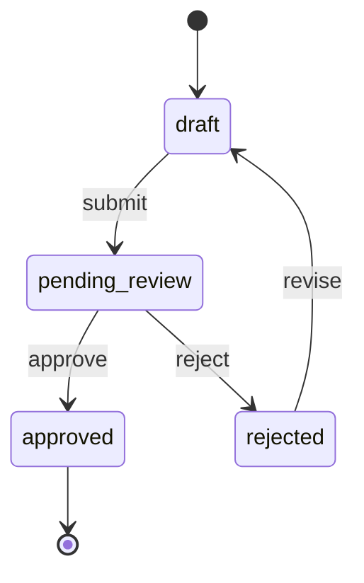

# Unified Audit: ETUS PMDocs v5.3 → v6.0

**Date:** 2026-03-23
**Scope:** Full framework — 9 agents, 45 skills, 13 commands, 5 gates, memory system, handoff protocol
**Goal:** Zero gaps between the product owner's intent and the developer's implementation
**Sources:** Strategic audit (interview-elicitation-improvement-audit), tactical audit (5-agent deep analysis), file-by-file state verification

---

## Current Scorecard

| Dimension | Current | Target | Primary Blocker |
|-----------|---------|--------|-----------------|
| Interview quality (idea extraction) | 7.5/10 | 9.5/10 | Generic probes — no archetype awareness |
| Developer completeness | 4.5/10 | 9.0/10 | No implementation packet; error/permission/state gaps |
| Gap detection (validation) | 5.5/10 | 9.0/10 | Validates structure, not semantics |
| Phase continuity | 7.0/10 | 9.0/10 | Handoff compression; EDGE-#/ASM-# not tracked to resolution |
| Change management | 3.0/10 | 8.0/10 | correct-course doesn't cascade; no rejection memory |

---

## What Is Already Strong (preserve these)

These are real competitive advantages and must not be weakened:

1. **Coverage-first ideation** — Problem framing before solutioning; actors before specs; journeys and use cases before architecture. Directionally correct and better than most frameworks.

2. **Traceability and SST** — The chain `ACT/JTBD/JOUR/UC/EDGE → BO-# → PRD-F-# → US-# → FS-# → impl-#` with single source of truth per content type is the right backbone.

3. **Validation infrastructure** — `check-sst`, `check-traceability`, `validate-gate` with adversarial mode, 3-layer checks (Structure/Content/Dependencies), mode-aware thresholds. This is where stronger enforcement can be added without redesigning.

4. **Feature-brief pressure test** — 4 challenge questions that push back on framing. Section-by-section approval. Pre-finalization check ("What would the NEXT skill have to invent if this is all they get?").

5. **State tracking in ideation** — `coverage-matrix.yaml` with `step_status`, `meta.active_step`, `meta.last_completed_step`, `meta.next_recommended_step`. This is the seed of a proper elicitation engine.

6. **Mode-aware thresholds** — Different completeness standards for Product (full), Feature (scoped), Bug (minimal), Spike (research). This is correct — not everything needs 26 documents.

---

## Core Diagnosis

### The fundamental problem

The framework captures many categories of information, but does **not yet guarantee semantic completeness** for the specific type of product or feature being discussed.

Today the system answers:
- "Did we cover some actors?" → Yes, count >= 2
- "Did we cover some edge cases?" → Yes, count >= 3

But the real implementation question is:
- "Did we cover the right questions for THIS kind of problem?"

If the feature is upload-related, did we ask about file size, formats, retries, antivirus, progress, replacement rules, partial failure? If the feature is approval workflow-related, did we ask about states, rejections, timeouts, delegation, audit trail, notifications, re-open rules?

Without **archetype-aware interrogation**, a strong generic interview still leaves dangerous blind spots.

### The second fundamental problem

The framework produces many useful documents, but the developer must synthesize across them. Documentation may be complete globally while still being inconvenient locally. "Everything needed to implement" is not only about coverage — it is also about **packaging**.

### The third fundamental problem

Validation checks structure (documents exist, IDs link, sections present) but not semantics (content is specific, measurable, contradiction-free, implementation-safe). A user story with `Given [USER], When [ACTION], Then [RESULT]` passes validation because the structure is correct, even though the content is placeholder.

---

## Recommendations

### TIER 0 — Architectural Changes (highest leverage)

---

#### T0.1 — Elicitation Engine: from prompt convention to state machine

**Current state:** The ideation skill has 11 sequential modules with `step_status` tracking in YAML. Feature-brief has a 10-step linear workflow with no state persistence between steps. Other skills (edge-case-sweep, journey-sweep, jtbd-extractor) are one-shot — no state, no progression.

**Problem:** Interview quality depends on prompt obedience alone. Without a hard workflow engine, the system will batch questions, skip probes, advance too early, or overfit to the user's first phrasing.

**Recommendation:** Create a first-class elicitation layer with explicit state and transition rules. Each question should track:

```yaml
# elicitation-state.yaml (per work item)
interview:
  module: actors          # current module
  question: ACT-Q2        # active question ID
  why: "Need to identify secondary actors affected by this feature"
  sufficiency: "Name + role + primary pain point"
  answer_status: confirmed  # confirmed | assumed | open | challenged
  follow_up: ACT-Q3       # next question unlocked

  vague_answer_escalation:
    trigger: "answer lacks specifics or numbers"
    probe: "Can you give me a specific recent example? What happened exactly?"

  reflection_checkpoint:
    trigger: "every 3-4 questions"
    action: "Before continuing, let me summarize what I understood: [summary]. Is this correct?"
```

**Implementation:**

| File | Change |
|------|--------|
| `.claude/skills/discovery/elicitation-engine/SKILL.md` | **NEW** — Reusable elicitation protocol with state machine |
| `.claude/skills/discovery/ideate/SKILL.md` | Extend to use elicitation-engine for each module |
| `.claude/skills/planning/feature-brief/SKILL.md` | Add state persistence between interview steps |
| `.claude/hooks/state_defaults.py` | Add `default_elicitation_state()` |
| `.claude/hooks/feature_lifecycle.py` | Track interview progression alongside doc progression |

**What the elicitation engine enforces:**

1. **One question per message** — Not a suggestion, a rule. The engine tracks `active_question` and won't advance until answered.
2. **Vague answer escalation** — When answer lacks specifics, auto-probe with concrete follow-ups:

   | Vague answer | Auto-probe |
   |---|---|
   | "It should be fast" | "Fast means <200ms? <1s? <5s? What number would make the user complain?" |
   | "It needs to be secure" | "Secure against which threat? Which data is sensitive? Who must NOT access it?" |
   | "Easy to use" | "Describe a user who would struggle. What would they try? Where would they get stuck?" |
   | "We'll figure that out later" | "Does this block the next phase? If yes, I need a decision now. If no, I'll register it as an open question with a deadline." |

3. **Reflection checkpoints** — Every 3-4 questions, summarize and confirm: "Before continuing, here's what I understood so far: [summary]. Is this correct?"

4. **Answer quality tracking** — Each answer is tagged `confirmed` / `assumed` / `open` / `challenged`. Gates block on `open` answers in critical dimensions.

---

#### T0.2 — Semantic Coverage Dimensions (replace count-based thresholds)

**Current state:** Coverage thresholds are count-based:
- Product: actors >= 2, JTBDs >= 2, journeys >= 2, use cases >= 4, edge cases >= 3, assumptions >= 3
- Feature: actors >= 1, JTBD >= 1, journey >= 1, use cases >= 2, edge cases >= 2, assumptions >= 1

These are useful as a floor but easy to satisfy without real completeness.

**Problem:** A feature can have 2 use cases, 2 edge cases, 1 assumption and still be missing: role/permission rules, explicit non-goals, success/failure visibility, integration boundaries, operational fallback, data mutation side effects.

**Recommendation:** Change coverage from raw counts to **dimension coverage**. For each work item, track whether these dimensions are covered:

```yaml
# coverage-matrix.yaml — new dimensions section
dimensions:
  problem_clarity:
    status: covered        # covered | partial | missing | not_applicable
    evidence: "Problem framed independently from solution in opportunity-pack.md"

  user_and_operator_roles:
    status: partial
    gap: "Admin role mentioned but permissions not defined"

  trigger_and_preconditions:
    status: covered

  core_behavior:
    status: covered

  success_signal:
    status: covered
    evidence: "Measurable acceptance criteria in feature-brief"

  explicit_non_goals:
    status: missing
    gap: "No NG-# items defined; out-of-scope section is empty"

  dependencies_and_integrations:
    status: partial
    gap: "Stripe integration mentioned but failure contract undefined"

  failure_modes_and_degraded_behavior:
    status: missing
    gap: "No error scenarios documented for API timeout or data corruption"

  permissions_and_policy_constraints:
    status: missing
    gap: "Roles mentioned but no permission matrix"

  data_mutations_and_side_effects:
    status: partial
    gap: "Events defined but cascade delete behavior undefined"

  notifications_and_downstream_consequences:
    status: missing

  observability_and_support_needs:
    status: missing

  lifecycle_states_and_transitions:
    status: partial
    gap: "States listed but invalid transitions not documented"

mandatory_dimensions:
  - problem_clarity
  - user_and_operator_roles
  - core_behavior
  - success_signal
  - explicit_non_goals
  - failure_modes_and_degraded_behavior
  - permissions_and_policy_constraints

coverage_score: 5/13   # dimensions covered or partial
critical_gaps: 4        # mandatory dimensions missing
```

**Implementation:**

| File | Change |
|------|--------|
| `.claude/skills/discovery/ideate/knowledge/coverage-matrix.yaml` | Redesign with dimensions section |
| `.claude/skills/discovery/ideate/SKILL.md` | Drive interview by uncovered dimensions, not just counts |
| `.claude/skills/validation/validate-gate/SKILL.md` | Fail on missing mandatory dimensions, not just low counts |

**Gate behavior change:**
- Current: "actors >= 2 → pass"
- New: "actors >= 2 AND `user_and_operator_roles.status != missing` AND `permissions_and_policy_constraints.status != missing` → pass"

---

#### T0.3 — Archetype-Aware Probe Packs

**Current state:** All features receive the same 5 interview questions in feature-brief, the same 8 edge-case categories, the same journey structure. Thresholds vary by mode (Product/Feature/Bug/Spike) but the actual probes do not.

**Problem:** Generic questions are not enough for complete handoff. Different problem types need different gap-checks that a senior PM or architect would remember to ask.

**Recommendation:** At the start of ideation or feature-brief, classify the work item into one or more archetypes, then activate specialized probe packs.

**Suggested archetypes:**

| Archetype | Mandatory Probes |
|-----------|-----------------|
| **CRUD / backoffice** | Pagination, sort, filter, bulk actions, soft delete, audit trail, export |
| **Workflow / approval** | States, transitions, invalid transitions, SLA/timeout, escalation, delegation, re-open, audit trail, notifications per transition |
| **Analytics / reporting** | Data freshness, aggregation rules, drill-down, export, caching, access control per report |
| **Data import / export** | Formats, size limits, malformed rows, preview before commit, validation rules, rollback on failure, resumability, progress indicator, duplicate handling |
| **API / integration / webhooks** | Auth scopes, retries, rate limits, idempotency, partial failure, replay, backward compatibility, versioning, timeout contracts |
| **Marketplace / two-sided** | Both-side flows, trust/safety, dispute resolution, fee structure, matching algorithm, supply-demand imbalance |
| **Subscriptions / billing** | Plans, upgrades/downgrades, proration, grace periods, dunning, refunds, tax, invoicing, cancellation |
| **AI / copilot / agent** | Input boundaries, hallucination risk, human override, refusal rules, evaluation criteria, feedback loop, cost per invocation |
| **Notifications / messaging** | Channels (email/push/in-app/SMS), frequency caps, opt-out, delivery guarantees, templates, localization |
| **Search / filter / discovery** | Indexing strategy, ranking algorithm, facets, autocomplete, fuzzy matching, zero-results handling, personalization |
| **Onboarding / funnel** | Steps, skip logic, progress persistence, abandonment recovery, A/B test hooks, activation metric |

**Implementation:**

| File | Change |
|------|--------|
| `.claude/skills/discovery/elicitation-archetypes/` | **NEW** directory with one `.md` probe pack per archetype |
| `.claude/skills/discovery/ideate/SKILL.md` | Add archetype detection step after `problem` module |
| `.claude/skills/planning/feature-brief/SKILL.md` | Load archetype probes after Q2 (what features?) |
| `coverage-matrix.yaml` | Record `active_archetypes` and track unresolved archetype probes |

**Example probe pack — Data Import/Export:**
```markdown
## Archetype: Data Import/Export — Mandatory Probes

1. "What file formats must be supported? (CSV, XLSX, JSON, XML, other?)"
2. "What is the maximum file size? What happens if it's exceeded?"
3. "What happens when a row has invalid data? Skip row? Reject entire file? Import valid rows only?"
4. "Can the user preview the data before committing the import?"
5. "What validation rules apply to each field? (format, uniqueness, referential integrity)"
6. "What happens if the import is interrupted? (network failure, browser close, timeout)"
7. "Can the user undo/rollback a completed import?"
8. "How are duplicate records handled? (skip, overwrite, create new, ask user)"
9. "Is there a progress indicator? Can the user cancel mid-import?"
10. "What is the expected volume? (10 rows? 10K rows? 1M rows?) How does that affect UX and architecture?"
11. "Who can import? Are there permission restrictions?"
12. "Is there an audit trail of who imported what and when?"
```

---

#### T0.4 — `/elicit` Command: Dedicated Stress-Test Phase

**Current state:** Gap-checking is spread across ideation (pressure test), feature-brief (pressure test), validate-gate (adversarial mode). There is no dedicated "interrogate the spec until ambiguity is gone" step.

**Problem:** Great implementation docs require a focused pass on ambiguity, contradiction, missing boundaries, hidden assumptions, and "what happens when this goes wrong?" — separate from document generation.

**Recommendation:** Create a dedicated command that does not create new solution ideas — it challenges the current understanding.

```
/elicit                    # Run full stress-test on current work item
/elicit [slug]             # Run on specific feature
/elicit --focus=permissions # Focus on specific dimension
/elicit --focus=failures    # Focus on failure modes
```

**Interrogation areas:**

1. **Goal vs non-goal clash** — "Is anything in your non-goals list actually needed for your success criteria to work?"
2. **Actor/permission mismatch** — "You mentioned [role] can do [action], but the permission model doesn't include this role."
3. **Missing lifecycle states** — "This entity has states [A, B, C]. What transitions are forbidden? What happens if someone tries A→C directly?"
4. **Missing failure handling** — "For each integration point, what happens when it fails? What does the user see? What does the system do?"
5. **Hidden operational dependencies** — "Who monitors this in production? What alert fires? What is the runbook?"
6. **Missing developer-facing contracts** — "For each API endpoint, what are the exact error codes, timeout values, and retry semantics?"
7. **Example-driven challenge** — "Give me one canonical success example, one ugly edge example, and one 'this should definitely not happen' example."

**Implementation:**

| File | Change |
|------|--------|
| `.claude/commands/elicit.md` | **NEW** — Command definition |
| `.claude/skills/discovery/elicit/SKILL.md` | **NEW** — Stress-test skill |

**When to run:**
- After `/ideate` and before `/feature brief`
- After `/feature brief` and before Planning Gate
- After `/plan requirements` and before Design phase
- On demand at any point

---

#### T0.5 — Non-Goals as First-Class Traceable Objects (NG-#)

**Current state:** Feature-brief Q4 asks "What is this feature explicitly NOT doing?" and PRD has scope in/out. But non-goals are prose, not tracked objects. They are not validated downstream.

**Problem:** Many implementation bugs come from building what was never desired, not from failing to build what was desired. If a non-goal says "no Excel support" but API spec quietly accepts XLSX, nobody detects it.

**Recommendation:** Introduce explicit non-goal IDs:

```markdown
## Non-Goals

NG-1: No Excel/XLSX support
  - Why: Complexity of macro handling outweighs value for MVP
  - Adjacent behavior rejected: File type detection must reject .xlsx with clear error
  - Until: Phase 2 reassessment (2026-Q3)
  - Downstream enforcement: api-spec must reject XLSX; feature-spec must document rejection UX

NG-2: No real-time collaboration
  - Why: Adds 3 months of complexity; users work solo today
  - Adjacent behavior rejected: No WebSocket connections, no presence indicators
  - Until: Post-launch based on user feedback
  - Downstream enforcement: tech-spec must not include WebSocket infrastructure
```

**Enforcement:**
- `check-traceability` must verify downstream docs don't reintroduce rejected behavior
- `validate-gate` must flag design or implementation scope that conflicts with NG-#
- `check-contradictions` must detect NG-# violations in api-spec, tech-spec, wireframes

**Implementation:**

| File | Change |
|------|--------|
| `.claude/skills/discovery/ideate/SKILL.md` | Add NG-# capture in `edges` or new `non_goals` module |
| `.claude/skills/planning/feature-brief/SKILL.md` | Promote Q4 output to NG-# format |
| `.claude/skills/planning/prd/SKILL.md` | Add NG-# section with enforcement rules |
| `.claude/skills/validation/check-traceability/SKILL.md` | Add NG-# violation detection |
| `.claude/skills/orchestrator/knowledge/ids.yml` | Add `NG` ID prefix |

---

#### T0.6 — Implementation Packet: Single Developer-Ready Artifact

**Current state:** Developers must read 10+ documents (PRD, user-stories, feature-specs, tech-spec, api-spec, data-dictionary, wireframes, etc.) and synthesize across them. Feature-brief is the closest to a single source, but it is PM-facing, not developer-facing.

**Problem:** Documentation may be complete globally while being inconvenient locally. A developer shouldn't have to grep across 17 files to understand how to build one feature.

**Recommendation:** Generate `implementation-packet.md` (or `dev-handoff.md`) that consolidates only what engineering needs:

```markdown
# Implementation Packet: [Feature Name]

## Problem & Non-Goals
- Problem: [from opportunity-pack / feature-brief]
- Non-goals: NG-1, NG-2 (what NOT to build)

## Target Actors & Permission Matrix
| Action | Public | User | Admin | Superadmin |
|--------|--------|------|-------|------------|
| View list | ✅ | ✅ | ✅ | ✅ |
| Create item | ❌ | ✅ | ✅ | ✅ |
| Delete item | ❌ | ❌ | ✅ | ✅ |

## Feature Scope (from PRD / feature-brief)
- FB-1: [behavior] → US-1, US-2
- FB-2: [behavior] → US-3

## Business Rules (from feature-spec)
- FS-import-1: [rule] + valid example + invalid example
- FS-import-2: [rule] + valid example + invalid example

## State Machine (from feature-spec, if >2 states)

- FORBIDDEN: draft → approved (must go through review)

## Acceptance Criteria (from user-stories)
- US-1: Given [specific], When [specific], Then [specific + metric]
- US-2: Given [specific], When [error condition], Then [specific error handling]

## Error Handling Matrix
| Scenario | Trigger | System Response | User Message | Retry? |
|----------|---------|-----------------|--------------|--------|
| API timeout | >3s no response | Circuit breaker opens | "Try again shortly" | Yes, 3x exponential |
| Invalid CSV row | Row fails validation | Skip row, continue | "Row 5 skipped: invalid email" | N/A |
| File too large | >100MB upload | Reject before processing | "File exceeds 100MB limit" | No |

## Data Validation Rules (from data-dictionary)
| Field | Type | Required | Format/Regex | Min/Max | Default | Valid Example | Invalid Example |
|-------|------|----------|-------------|---------|---------|--------------|-----------------|
| email | VARCHAR(254) | Yes | `^[^\s@]+@[^\s@]+\.[^\s@]+$` | 5/254 chars | — | alice@example.com | alice@.com |
| phone | VARCHAR(20) | No | E.164 `^\+[1-9]\d{1,14}$` | — | — | +5511999998888 | 11999998888 |

## API Contracts (from api-spec)
- POST /api/v1/imports
  - Auth: Bearer token, role >= user
  - Request: multipart/form-data, file field, max 100MB
  - 200: `{ import_id, status: "processing", rows_total }`
  - 400: `{ error: "invalid_format", detail: "Expected CSV, got XLSX" }`
  - 413: `{ error: "file_too_large", max_bytes: 104857600 }`
  - Idempotency: X-Idempotency-Key header required
  - Timeout: client 60s, server 30s processing
  - Retry: safe with same idempotency key

## Performance Requirements (from tech-spec)
- NFR-1: Import processing < 5s for 1000 rows (p95)
- NFR-2: API response < 200ms for status check

## Observability Requirements
| What to log | Level | When |
|-------------|-------|------|
| Import started | INFO | File received |
| Row validation failure | WARN | Each invalid row |
| Import completed | INFO | All rows processed |
| Import failed | ERROR | Unrecoverable error |

| Metric | Type | Alert threshold |
|--------|------|----------------|
| import_duration_seconds | Histogram | p95 > 10s |
| import_error_rate | Counter | > 5% in 5min window |

## Open Questions
- ⚠️ BLOCKER: "What happens to in-progress imports if the server restarts?" → Must answer before coding
- ℹ️ DEFERRED: "Support for Excel format" → Phase 2 (see NG-1)

## Anti-Requirements
- NG-1: No Excel/XLSX support (reject with 400 error)
- NG-2: No real-time progress WebSocket (polling only)
```

**Implementation:**

| File | Change |
|------|--------|
| `.claude/skills/implementation/implementation-packet/SKILL.md` | **NEW** — Generates the packet by reading all upstream docs |
| `.claude/skills/implementation/implementation-packet/knowledge/template.md` | **NEW** — Template with all sections |
| `.claude/commands/implement.md` | Add implementation-packet generation before impl-plan |

**When generated:**
- Product mode: after `plan requirements`, before Design phase
- Feature mode: after `feature stories` or `design-delta`

---

### TIER 1 — Validation & Detection Upgrades

---

#### T1.1 — Contradiction Detection Across Artifacts

**Current state:** `check-sst` validates ownership rules (Given/When/Then only in user-stories.md). `check-traceability` validates ID chains. Neither detects semantic contradictions.

**Problem:** If PRD says "admin-only" but API spec exposes editor access, nobody detects it. If feature-brief says "CSV only" but API spec accepts XLSX, nobody detects it.

**Recommendation:** New validation skill that checks:

| Contradiction Type | Example |
|-------------------|---------|
| Priority mismatch | PRD-F-1 is "Must Have" but prioritization.md ranks parent O-1 as P3 |
| Scope conflict | feature-brief says "CSV only", api-spec accepts XLSX |
| Role mismatch | user-stories says "admin only", api-spec doesn't check role |
| Sync/async conflict | user-story says "synchronous confirmation", feature-spec says "async eventual" |
| Rollout conflict | release-plan says "canary", impl-plan assumes big bang |
| NG-# violation | NG-1 says "no Excel", api-spec silently parses .xlsx |
| NFR vs implementation | NFR-1 says "<200ms", impl-plan has no caching strategy |

**Implementation:**

| File | Change |
|------|--------|
| `.claude/skills/validation/check-contradictions/SKILL.md` | **NEW** |
| `.claude/skills/validation/validate-gate/SKILL.md` | Integrate contradiction check into Layer 2 (Content) |

---

#### T1.2 — Acceptance Criteria Quality Validation

**Current state:** `validate-gate` Layer 2 checks "features have acceptance criteria" but not whether they are verifiable. A story with `Then user sees fast results` passes.

**Recommendation:** Add semantic quality checks:

- Auto-fail if Given/When/Then contains `[PLACEHOLDER]`, `[TBD]`, `[TODO]`
- Auto-fail if `Then` clause contains vague terms: "fast", "easy", "user-friendly", "robust", "seamless", "intuitive", "real-time" (without numbers)
- Require at least 1 error/failure scenario per user story (not just happy path)
- Require measurable success criterion for each PRD-F-# ("80% of users complete in <2 clicks", not "users can easily find invoices")

**Vague terms to flag:**

| Term | Replace with |
|------|-------------|
| "fast" | "response time < X ms at p95" |
| "easy to use" | "new user completes [task] without help in < X minutes" |
| "secure" | specific threat model + encryption + auth requirements |
| "scalable" | "supports X concurrent users / Y requests per second" |
| "real-time" | "latency < X ms" |
| "robust" | "handles [specific failure modes] with [specific behavior]" |
| "seamless" | specific integration/transition requirements |

**Implementation:**

| File | Change |
|------|--------|
| `.claude/skills/validation/validate-gate/SKILL.md` | Add quality checks to Layer 2 |
| `.claude/skills/validation/check-sst/SKILL.md` | Add vague-term lint rule |

---

#### T1.3 — Edge Case Resolution Tracking

**Current state:** `check-traceability` validates the chain `BO-# → PRD-F-# → US-# → FS-# → impl-#`. It does NOT validate that `EDGE-#` items from ideation have corresponding handling downstream.

**Problem:** An edge case like "EDGE-1: File exceeds 100MB" is identified during ideation but no user story, feature-spec rule, or API error code addresses it. The edge case was discovered but never resolved.

**Recommendation:** Extend traceability to cover EDGE-# resolution:

```
For each EDGE-#:
  MUST have resolution in at least one of:
    - user-stories.md (Given/When/Then for edge case)
    - feature-spec-*.md (FS-# rule for handling)
    - tech-spec.md (ADR/NFR for handling)
    - api-spec.md (error response code)

  OR explicitly deferred:
    - Marked "Deferred to [phase]" with rationale
    - Tracked in non-goals or backlog

  If unresolved and not deferred:
    - Flag as CRITICAL gap in validation report
```

**Implementation:**

| File | Change |
|------|--------|
| `.claude/skills/validation/check-traceability/SKILL.md` | Add EDGE-# → resolution chain |
| `.claude/skills/validation/validate-gate/SKILL.md` | Block on unresolved EDGE-# at Requirements and Implementation gates |

---

#### T1.4 — Assumption Lifecycle (not just a list)

**Current state:** `assumption-audit` captures `statement, evidence, status (assumed|open|resolved), risk_if_false, validation_needed`. But assumptions are not operationalized — high-risk open assumptions don't block gates, and there's no validation plan.

**Recommendation:** Upgrade each ASM-# to a lifecycle object:

```yaml
ASM-3:
  statement: "Users won't exceed 10K rows per import"
  risk_level: high            # high | medium | low
  evidence_strength: weak     # strong | moderate | weak | none
  status: open                # open | validating | validated | invalidated | deferred
  owner: "PM"
  validation_method: "Analyze current CSV sizes from 20 customers"
  validation_deadline: "Before Design phase"
  blocking: true              # blocks gate if still open at deadline
  fallback_if_false: "Add chunked import with progress bar"
```

**Gate enforcement:**
- Block Design phase if any `blocking: true` + `status: open` assumption exists without a validation plan
- Block Implementation phase if any `risk_level: high` + `status: open` assumption remains

**Implementation:**

| File | Change |
|------|--------|
| `.claude/skills/discovery/assumption-audit/SKILL.md` | Expand to lifecycle format |
| `.claude/skills/discovery/ideate/knowledge/coverage-matrix.yaml` | Track assumption lifecycle status |
| `.claude/skills/validation/validate-gate/SKILL.md` | Add assumption status checks per gate |

---

#### T1.5 — Feature Interaction Matrix

**Current state:** PRD has a "Dependencies" field per feature, but no cross-feature analysis. Features that affect each other are not mapped.

**Problem:** Feature A (bulk import) and Feature B (real-time dashboard) may share the same database table. If A writes 10K rows, B's real-time query slows down. Nobody detects this until integration testing.

**Recommendation:** Add a compact matrix to PRD or as a separate artifact:

```markdown
## Feature Interaction Matrix

|           | PRD-F-1 (Import) | PRD-F-2 (Dashboard) | PRD-F-3 (Export) | PRD-F-4 (Auth) |
|-----------|-------------------|---------------------|-------------------|-----------------|
| PRD-F-1   | —                 | Data: writes to same table | None | Constraint: requires F-4 |
| PRD-F-2   | Perf: large imports slow queries | — | Data: reads same aggregates | None |
| PRD-F-3   | None              | None                | —                 | Constraint: requires F-4 |
| PRD-F-4   | Constraint: auth for import | None | Constraint: auth for export | — |
```

**Implementation:**

| File | Change |
|------|--------|
| `.claude/skills/planning/prd/SKILL.md` | Add feature interaction analysis step |
| `.claude/skills/planning/prd/knowledge/template.md` | Add matrix template |

---

### TIER 2 — Developer Completeness Gaps

---

#### T2.1 — Error Handling Matrix (ES-#)

**Current state:** Feature-spec has an optional, unstructured "Error Handling" section. API-spec lists error codes but not the full system behavior. No document captures the complete chain: trigger → system action → user message → retry strategy → rollback.

**Recommendation:** Mandatory error handling matrix in feature-spec and implementation-packet:

```markdown
## Error Handling Matrix

ES-1: API Timeout During Import
  Trigger: POST /api/imports returns no response within 30s
  System: Circuit breaker opens; queue import for retry
  User sees: "Import is taking longer than expected. We'll notify you when it's done."
  Retry: Automatic, 3x with exponential backoff (1s, 4s, 16s)
  Rollback: If all retries fail, mark import as "failed"; no partial data committed
  Log: ERROR with import_id, timeout_duration, retry_count
  Alert: If > 5 failed imports in 10min → page on-call

ES-2: Malformed CSV Row
  Trigger: Row N fails field validation
  System: Skip row, continue processing remaining rows
  User sees: "Row 5 skipped: email format invalid. 95/100 rows imported successfully."
  Retry: N/A (user can fix CSV and re-import)
  Rollback: N/A (valid rows are committed)
  Log: WARN with import_id, row_number, field_name, validation_rule_violated
```

**Implementation:**

| File | Change |
|------|--------|
| `.claude/skills/planning/feature-spec/SKILL.md` | Make Error Handling Matrix mandatory |
| `.claude/skills/planning/feature-spec/knowledge/template.md` | Add ES-# template |
| `.claude/skills/orchestrator/knowledge/ids.yml` | Add `ES` ID prefix |

---

#### T2.2 — Permission Matrix

**Current state:** "Somente admins podem fazer X" appears in design notes but no formal permission matrix exists anywhere.

**Recommendation:** Mandatory in tech-spec or implementation-packet:

```markdown
## Permission Matrix

| Action | Public | Authenticated | Editor | Admin | Superadmin |
|--------|--------|---------------|--------|-------|------------|
| View public list | ✅ | ✅ | ✅ | ✅ | ✅ |
| View own items | ❌ | ✅ | ✅ | ✅ | ✅ |
| Create item | ❌ | ✅ | ✅ | ✅ | ✅ |
| Edit own item | ❌ | ✅ | ✅ | ✅ | ✅ |
| Edit any item | ❌ | ❌ | ✅ | ✅ | ✅ |
| Delete item | ❌ | ❌ | ❌ | ✅ | ✅ |
| Manage users | ❌ | ❌ | ❌ | ❌ | ✅ |
```

**Implementation:**

| File | Change |
|------|--------|
| `.claude/skills/architecture/tech-spec/SKILL.md` | Add permission matrix section |
| `.claude/skills/implementation/implementation-packet/SKILL.md` | Include in packet |

---

#### T2.3 — Data Validation Rules in Data Dictionary

**Current state:** `data-dictionary.md` defines field names and types but not validation rules, formats, or examples.

**Recommendation:** For each field:

```markdown
dict.user.email:
  Type: VARCHAR(254)
  Required: Yes
  Format: RFC 5322 (loose)
  Validation: ^[^\s@]+@[^\s@]+\.[^\s@]+$
  Max length: 254 characters
  Storage: Normalized to lowercase
  Valid example: alice.smith+tag@example.com
  Invalid example: alice@.com
  On invalid: 400 Bad Request with field-level error
```

**Implementation:**

| File | Change |
|------|--------|
| `.claude/skills/data-design/data-dictionary/SKILL.md` | Add validation rules per field |

---

#### T2.4 — State Machine Diagrams (mandatory for >2 states)

**Current state:** Feature-spec mentions states but doesn't require formal state diagrams with explicit forbidden transitions.

**Recommendation:** For any feature with >2 states, require:

1. Mermaid state diagram
2. Valid transitions with triggers
3. **Forbidden transitions with reason** (e.g., "draft → approved is FORBIDDEN because review is required")
4. Side effects per transition (e.g., "approved → email sent to requestor")

**Implementation:**

| File | Change |
|------|--------|
| `.claude/skills/planning/feature-spec/SKILL.md` | Require state diagram if >2 states |
| `.claude/skills/planning/feature-spec/knowledge/template.md` | Add state machine template |

---

#### T2.5 — Observability Checklist

**Current state:** ~5% coverage. No document specifies logs, metrics, or alerts per feature.

**Recommendation:** Add to quality-checklist and implementation-packet:

```markdown
## Observability Requirements

### Logs (per feature)
| Event | Level | Fields | When |
|-------|-------|--------|------|
| Import started | INFO | import_id, user_id, file_size, row_count | File received |
| Row validation failed | WARN | import_id, row_number, field, rule_violated | Each invalid row |
| Import completed | INFO | import_id, rows_imported, rows_skipped, duration_ms | Success |
| Import failed | ERROR | import_id, error_type, stack_trace | Unrecoverable |

### Metrics
| Metric | Type | Labels |
|--------|------|--------|
| import_duration_seconds | Histogram | status={success,failure} |
| import_rows_total | Counter | outcome={imported,skipped,failed} |
| import_error_rate | Gauge | — |

### Alerts
| Condition | Severity | Channel | Runbook |
|-----------|----------|---------|---------|
| import_error_rate > 5% for 5min | WARNING | #ops-alerts | /runbooks/import-errors |
| import_duration_seconds p95 > 30s | CRITICAL | PagerDuty | /runbooks/import-slow |
```

**Implementation:**

| File | Change |
|------|--------|
| `.claude/skills/implementation/quality-checklist/SKILL.md` | Add observability section |
| `.claude/skills/implementation/implementation-packet/SKILL.md` | Include in packet |

---

#### T2.6 — Idempotency, Retry, and Concurrency Specs

**Current state:** No document answers: "Is this operation safe for retry?" "What happens if two users edit the same record?" "Do we need idempotency keys?"

**Recommendation:** Add to api-spec per endpoint:

```markdown
POST /api/v1/imports
  Idempotency: Required (X-Idempotency-Key header)
  Retry safety: Safe with same key (returns cached response)
  Concurrency: Last-write-wins (no optimistic locking)
  Client timeout: 60 seconds
  Server timeout: 30 seconds processing
  Retry strategy: Exponential backoff 1s, 2s, 4s (max 3 retries)
```

**Implementation:**

| File | Change |
|------|--------|
| `.claude/skills/api-design/api-spec/SKILL.md` | Add idempotency/retry/concurrency per endpoint |

---

### TIER 3 — Flow & Change Management

---

#### T3.1 — Gate Decision Memory

**Current state:** When the user says "NO-GO" or "ITERATE" at a gate, the rejection and its reasoning are not persisted. The next phase might propose exactly what was rejected.

**Recommendation:** Create `state/gate-decisions.yaml`:

```yaml
gates:
  discovery_gate:
    decision: ITERATE
    timestamp: "2026-03-23T14:30:00Z"
    feedback: "Vision needs to emphasize cost reduction, not speed"
    rejected_approaches:
      - "Speed-focused value proposition"
    conditions_for_go: "Reframe BO-1 around cost savings with specific $ targets"

  requirements_gate:
    decision: DESCOPE
    timestamp: "2026-03-23T16:00:00Z"
    feedback: "PRD-F-5 (Excel support) too complex for MVP"
    descoped_items:
      - "PRD-F-5"
    created_non_goals:
      - "NG-1: No Excel support until Phase 2"
```

**Implementation:**

| File | Change |
|------|--------|
| `.claude/hooks/state_defaults.py` | Add `default_gate_decisions()` |
| `.claude/skills/validation/validate-gate/SKILL.md` | Persist decisions after each gate |
| `.claude/skills/discovery/ideate/SKILL.md` | Read gate-decisions.yaml to avoid repeating rejected approaches |

---

#### T3.2 — Correct-Course Cascade

**Current state:** `/correct-course` generates a change-proposal.md but does not guarantee downstream documents are updated. If PRD-F-3 is descoped, user-stories, feature-specs, impl-plan, release-plan, and quality-checklist may still reference it.

**Recommendation:** After change-proposal approval, automatically:

1. Identify all documents referencing changed IDs (via grep)
2. Generate proposed diffs for each affected document
3. Present before/after for user approval
4. Apply changes
5. Update ids.yml, coverage-matrix, and state files
6. If execution adapter enabled, flag which external issues need updates

**Implementation:**

| File | Change |
|------|--------|
| `.claude/skills/planning/correct-course/SKILL.md` | Add reconciliation phase |
| `.claude/commands/correct-course.md` | Expand to include cascade logic |

---

#### T3.3 — Handoff Reports as Index, Not Summary

**Current state:** Each phase generates a JSON handoff (discovery.json, planning.json, etc.) with `key_decisions` (3-5 bullet points) and `recommendations_for_next_phase`. Downstream agents read only the JSON summary.

**Problem:** The handoff is a summary that loses evidence, rationale, and alternatives rejected. The JSON becomes a compression bottleneck.

**Recommendation:** Instruct downstream agents to use the JSON as an INDEX and read the full documents:

```
1. Read discovery.json → understand structure and document paths
2. Read project-context.md → full 5W2H context
3. Read product-vision.md → full vision, BO-#, personas
4. Read discovery-report.md → evidence, H-#, insights
5. Read coverage-matrix.yaml → ideation coverage status
```

Also enrich handoff JSON with:
- `rejected_approaches[]` — what was tried and dismissed
- `open_questions[]` — what remains unanswered
- `gate_feedback` — user's exact feedback at the gate
- `critical_assumptions[]` — ASM-# that downstream must respect

**Implementation:**

| File | Change |
|------|--------|
| `.claude/skills/orchestrator/knowledge/handoff-schema.json` | Add rejected_approaches, open_questions, gate_feedback, critical_assumptions |
| All 7 agent files | Add instruction to read full upstream docs, not just JSON |

---

### TIER 4 — Interview Technique Upgrades

---

#### T4.1 — Mom Test Probes

Add to all interview skills:

```markdown
## Interview Technique: Past Behavior Over Future Opinion

NEVER ask: "Would you use this?"
ALWAYS ask: "Tell me about the last time you dealt with [problem]. What happened?"

NEVER ask: "Is this important to you?"
ALWAYS ask: "How much time/money did you spend on this workaround last month?"

NEVER ask: "Don't you think X would help?"
ALWAYS ask: "What have you already tried? Why didn't it work?"
```

**Implementation:** Add `## Interview Techniques` section to all 7 agent files in `.claude/agents/`.

---

#### T4.2 — Forces of Progress (Anxiety + Habit)

Add to `discovery-report.md` template:

```markdown
## Forces of Progress Analysis

| Force | Description | Evidence | Mitigation |
|-------|-------------|----------|------------|
| Push (pain with current state) | [what's broken] | [from interviews] | — |
| Pull (attraction to new solution) | [what draws them] | [from interviews] | — |
| Anxiety (fear of change) | [what scares them about switching] | [from interviews] | [how we reduce this] |
| Habit (inertia of status quo) | [what keeps them in current behavior] | [from interviews] | [how we break this] |
```

**Implementation:**

| File | Change |
|------|--------|
| `.claude/skills/discovery/discovery-report/SKILL.md` | Add Forces of Progress section |

---

#### T4.3 — Pre-Mortem at Gates

Add mandatory pre-mortem exercise before Discovery Gate and Requirements Gate:

```
"It's 6 months from now and this project failed completely.
What are the 3 most likely reasons it failed?"

Categories to explore:
- Technical failure (architecture, scaling, integration)
- Market failure (wrong audience, timing, competition)
- Adoption failure (anxiety, habit, switching cost)
- Organizational failure (politics, priority shift, resource pull)
```

**Implementation:**

| File | Change |
|------|--------|
| `.claude/skills/validation/validate-gate/SKILL.md` | Add pre-mortem step before GO decision |

---

#### T4.4 — Kill Criteria

Add to `product-vision.md`:

```markdown
## Kill Criteria

"At what point do we decide this isn't worth continuing?"

| Metric | Kill Threshold | Measurement Point |
|--------|---------------|-------------------|
| User activation rate | < 10% after 3 months | Monthly cohort analysis |
| Weekly active usage | < 100 users after 6 months | Analytics dashboard |
| Customer acquisition cost | > $500/user | Marketing spend / signups |
```

**Implementation:**

| File | Change |
|------|--------|
| `.claude/skills/discovery/product-vision/SKILL.md` | Add kill criteria question |

---

## Implementation Roadmap

### Phase 1 — Harden Interview Quality (highest leverage)

| # | Change | Files | New/Modify |
|---|--------|-------|------------|
| 1 | Elicitation Engine skill | `discovery/elicitation-engine/SKILL.md` | NEW |
| 2 | Semantic Coverage Dimensions | `ideate/knowledge/coverage-matrix.yaml`, `ideate/SKILL.md`, `validate-gate/SKILL.md` | MODIFY |
| 3 | Archetype Probe Packs (12 archetypes) | `discovery/elicitation-archetypes/*.md` | NEW |
| 4 | `/elicit` stress-test command + skill | `commands/elicit.md`, `discovery/elicit/SKILL.md` | NEW |
| 5 | Non-Goals as NG-# traceable IDs | `ideate/SKILL.md`, `feature-brief/SKILL.md`, `prd/SKILL.md`, `check-traceability/SKILL.md`, `ids.yml` | MODIFY |
| 6 | Mom Test + Forces of Progress + Pre-Mortem | All 7 agents, `discovery-report/SKILL.md`, `validate-gate/SKILL.md` | MODIFY |

### Phase 2 — Harden Developer Completeness

| # | Change | Files | New/Modify |
|---|--------|-------|------------|
| 7 | Implementation Packet skill | `implementation/implementation-packet/SKILL.md` + template | NEW |
| 8 | Error Handling Matrix (ES-#) | `feature-spec/SKILL.md` + template, `ids.yml` | MODIFY |
| 9 | Permission Matrix | `tech-spec/SKILL.md` | MODIFY |
| 10 | Data Validation Rules | `data-dictionary/SKILL.md` | MODIFY |
| 11 | State Machine requirement | `feature-spec/SKILL.md` + template | MODIFY |
| 12 | Observability Checklist | `quality-checklist/SKILL.md` | MODIFY |
| 13 | Idempotency/Retry/Concurrency | `api-spec/SKILL.md` | MODIFY |

### Phase 3 — Harden Gap Detection

| # | Change | Files | New/Modify |
|---|--------|-------|------------|
| 14 | Contradiction Detection skill | `validation/check-contradictions/SKILL.md` | NEW |
| 15 | Acceptance Criteria Quality + Vague Term Lint | `validate-gate/SKILL.md`, `check-sst/SKILL.md` | MODIFY |
| 16 | EDGE-# Resolution Tracking | `check-traceability/SKILL.md`, `validate-gate/SKILL.md` | MODIFY |
| 17 | Assumption Lifecycle | `assumption-audit/SKILL.md`, `coverage-matrix.yaml`, `validate-gate/SKILL.md` | MODIFY |
| 18 | Feature Interaction Matrix | `prd/SKILL.md` + template | MODIFY |

### Phase 4 — Harden Flow & Change Management

| # | Change | Files | New/Modify |
|---|--------|-------|------------|
| 19 | Gate Decision Memory | `state_defaults.py`, `validate-gate/SKILL.md` | MODIFY |
| 20 | Correct-Course Cascade | `correct-course/SKILL.md`, `correct-course.md` | MODIFY |
| 21 | Handoff Reports enriched | `handoff-schema.json`, all 7 agents | MODIFY |
| 22 | Kill Criteria | `product-vision/SKILL.md` | MODIFY |

---

## Expected Outcome

| Dimension | Current | After Phase 1-2 | After Phase 3-4 |
|-----------|---------|-----------------|-----------------|
| Interview quality | 7.5/10 | 9.0/10 | 9.5/10 |
| Developer completeness | 4.5/10 | 8.0/10 | 9.0/10 |
| Gap detection | 5.5/10 | 7.0/10 | 9.0/10 |
| Phase continuity | 7.0/10 | 7.5/10 | 9.0/10 |
| Change management | 3.0/10 | 4.0/10 | 8.0/10 |

---

## New Definition of Done

A feature or product is only interview-complete when:

1. The problem is clear independently from the proposed solution
2. Actors, operators, and approvers are explicit with permission matrix
3. Non-goals are explicit and traceable as NG-# IDs
4. Archetype-specific probes have been exhausted
5. Critical journeys, use cases, and edge cases are covered with resolution tracking
6. Active assumptions have owners, validation plans, and deadlines
7. The chosen solution has been stress-tested via `/elicit`
8. Contradictions have been checked across all artifacts
9. Error handling matrix, state machines, and validation rules are documented
10. Everything is consolidated into a single implementation packet
11. Remaining unknowns are explicit enough that engineering knows what must be answered before coding
12. Kill criteria are defined

That is the shift from "good documentation framework" to "exceptionally effective elicitation system."

---

## Summary

ETUS PMDocs already has the right bones. To become truly exceptional, it does **not** primarily need more document types.

It needs:

1. **Stronger enforcement of interview behavior** — Elicitation engine with state machine, not prompt conventions
2. **Smarter, archetype-aware questioning** — Probe packs that ask what a senior PM would remember
3. **Semantic completeness checks** — Dimension coverage, not count thresholds
4. **Contradiction and ambiguity detection** — Cross-document validation, vague-term lint, NG-# enforcement
5. **A final developer-ready implementation packet** — One document, everything needed, no guessing
6. **Gate memory and change cascade** — Rejections remembered, changes propagated

Those six changes would eliminate the gap between "the docs existed" and "we still had to guess."
