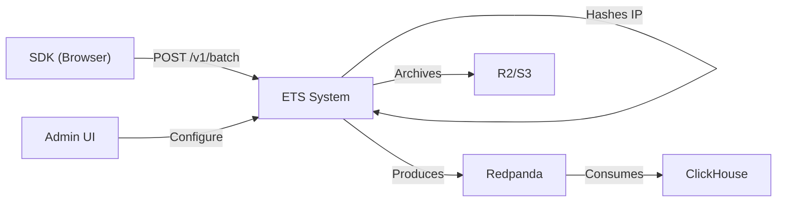

## DEPENDENCY RESOLUTION

**Reference:** `.claude/skills/orchestrator/dependency-graph.yaml`

**BLOCKS** (must exist — auto-invoke if missing):
- `docs/ets/projects/{project-slug}/planning/prd.md` — Needed for feature scope to inform system design.
- `docs/ets/projects/{project-slug}/planning/user-stories.md` — Needed for behavioral requirements.

**ENRICHES** (improves output — warn if missing):
- `docs/ets/projects/{project-slug}/discovery/project-context.md` — Tech stack constraints inform architecture choices.

**Resolution protocol:**
1. Read `dependency-graph.yaml` → `architecture-diagram.requires: [prd, user-stories]`
2. Check both required docs exist, non-empty, not DRAFT
3. If missing → auto-invoke upstream skill → wait → continue
4. Check ENRICHES → warn if missing, proceed

## ARTIFACT SAVE RULE

**MANDATORY:** This skill MUST write its artifact to disk before declaring complete.

1. Verify target directory exists → create with `mkdir -p` if needed
2. Write the complete document using the Write tool to the exact path specified in Output Document Structure
3. Displaying content in chat is NOT saving — the file MUST exist on the filesystem
4. After writing, display the CLOSING SUMMARY with the saved path
5. Only THEN propose the next step

**If the Write fails:** Report the error to the user. Do NOT proceed to the next skill.

## INTERACTION PROTOCOL

This skill follows the ETUS interaction standard. Your role is a thinking partner, not an interviewer — suggest alternatives, challenge assumptions, and explore what-ifs instead of only extracting information.

1. **One question per message** — Never batch multiple questions. Ask one, wait for the answer, then ask the next. Use the AskUserQuestion tool when available for structured choices.

2. **3-4 suggestions for choices** — When the user needs to choose a direction, present 3-4 concrete options with a brief description of each. Highlight your recommendation.

3. **Propose approaches before generating** — Before generating any content section, propose 2-3 approaches with tradeoffs and a recommendation.

4. **Present output section-by-section** — Don't generate the full document at once. Present each major section, ask "Does this capture it well? Anything to adjust?" and only proceed after approval.

5. **Track outstanding questions** — If something can't be answered now, classify it:
   - **Resolve before next phase** — Blocks the handoff.
   - **Deferred to [phase name]** — Noted and carried forward.

6. **Multiple handoff options** — At completion, present 3-4 next steps as options.

7. **Resume existing work** — Before starting, check if the target artifact already exists at the expected path. If it does, ask the user: "I found an existing architecture-diagram.md at [path]. Should I continue from where it left off, or start fresh?" If resuming, read the document, summarize the current state, and continue from outstanding gaps.

8. **Assess if full process is needed** — If the user's input is already detailed with clear requirements, specific acceptance criteria, and defined scope, don't force the full interview. Confirm understanding briefly and offer to skip directly to document generation. Only run the full interactive process when there's genuine ambiguity to resolve.

## MEMORY PROTOCOL

This skill reads and writes persistent memory to maintain context across sessions.

**On start (before any interaction):**
1. Read `docs/ets/.memory/project-state.md` — know where the project is
2. Read `docs/ets/.memory/decisions.md` — don't re-question closed decisions
3. Read `docs/ets/.memory/preferences.md` — apply user/team preferences silently
4. Read `docs/ets/.memory/patterns.md` — apply discovered patterns
5. If any memory file doesn't exist, create it with the default template

**On finish (after saving artifact, before CLOSING SUMMARY):**
1. `project-state.md` is updated **automatically** by the PostToolUse hook — do NOT edit it manually.
2. If the user chose between approaches during this skill → run via Bash:
   `python3 .claude/hooks/memory-write.py decision "<decision>" "<rationale>" "<this-skill-name>" "<phase>" "<tag1,tag2>"`
3. If the user expressed a preference → run via Bash:
   `python3 .claude/hooks/memory-write.py preference "<preference>" "<this-skill-name>" "<category>"`
4. If a recurring pattern was identified → run via Bash:
   `python3 .claude/hooks/memory-write.py pattern "<pattern>" "<this-skill-name>" "<applies_to>"`

**The `.memory/*.md` files are read-only views** generated automatically from `memory.db`. Never edit them directly.

## WHEN TO USE / DEPTH GUIDE

**Use full version when:**
- New system architecture (greenfield)
- Major refactoring or migration to a different architecture pattern
- Multiple services, databases, or external integrations involved

**Use short version when:**
- Adding a feature that fits within the existing architecture
- Incremental change to one container or component
- Even in short version, still include: updated Container Diagram and Technology Stack table for the affected components

### Skill-Specific Interaction Patterns

- **Tech stack decisions:** For each architecture layer (frontend framework, backend language, database, infrastructure), propose 3-4 technology options with tradeoffs and a recommendation. Let the user choose before committing.
- **Architecture style:** Before diagramming, propose 2-3 architecture approaches (e.g., monolith, modular monolith, microservices) with pros/cons for this specific project. Ask the user to pick.
- **C4 diagrams — one level at a time:** Present the Context diagram (Level 1) first and ask for approval. Only after approval, proceed to the Container diagram (Level 2). Then Component (Level 3). Never generate all levels at once.
- **Handoff options:** At completion, present:
  1. **Proceed to Tech Spec** (Recommended) — Define NFR-# targets and ADR-# architecture decisions
  2. **Refine architecture** — Adjust diagrams, add detail, change technology choices
  3. **Explore alternative approach** — Revisit architecture style or tech stack
  4. **Pause** — Save progress and return later

# Architecture Diagram Skill

## Purpose

This skill generates `docs/ets/projects/{project-slug}/architecture/architecture-diagram.md`, the visual and textual blueprint of the system. It defines:

- **Context Diagram** — System boundary, external actors, and dependencies
- **Container Diagram** — Major applications, databases, message brokers, external services
- **Component Diagram** — Internal structure of key containers (e.g., Event Tracker service)
- **Technology Stack** — Language, runtime, framework choices with justification
- **Deployment View** — Where containers run (Cloudflare Workers, Hetzner VPS, etc.)

This document is the foundation that all other design documents (tech-spec.md, data-design.md, ux-design.md, api-spec.md) reference.

## Context Loading (4-Level Fallback)

1. **From upstream path** (argument-hint): If user provides path, read that file first
2. **From project-context.md** (docs/ets/projects/{project-slug}/project-context.md): System description, business goals
3. **From product-vision.md** (docs/ets/projects/{project-slug}/product-vision.md): Long-term direction, market positioning
4. **Ask user** (if nothing found): "Describe the system in 3-5 sentences and name the major components"

## C4 Model (Context → Container → Component)

### Level 1: Context Diagram

Map the system boundary and external systems:

```
External User / API Client → [System Under Study] → External Service A
                                      ↓
                              External Service B
```

For ETS Analytics:
- SDKs → Interceptor → Event Tracker → Redpanda → ClickHouse
- External: Cloudflare, Hetzner, R2, rDNS providers

**Mermaid Example:**


### Level 2: Container Diagram

Show major applications, databases, message brokers within the system:

```
Container 1 (CF Worker) | Container 2 (Go Service) | Container 3 (DB)
Interceptor             | Event Tracker            | ClickHouse
```

For ETS (13 services):
- **CF Workers** (3): Interceptor, Bot-Data-Updater, Admin
- **Go Services** (8): Event Tracker, Normalizer, Context Merge, Enricher, Projector, Quality, Event Writer, Raw Archiver
- **Message Broker** (1): Redpanda
- **Data Stores** (2): ClickHouse (OLAP), D1 (metadata)
- **Object Storage** (1): R2/S3 (archives)

### Level 3: Component Diagram

Show internal structure of complex containers. Example: Event Tracker internals:

```
Request Handler → Validation → IP Hash → Batching → Redpanda Producer → HTTP 202 Response
```

## Technology Stack Decisions

For each major technology choice, document:
- **Component** — What is chosen (e.g., Redpanda for event streaming)
- **Technology** — Specific product (e.g., Redpanda vs. Kafka vs. RabbitMQ)
- **Justification** — Why chosen (cost, latency, operational overhead, team expertise)
- **Trade-offs** — What we gave up (consistency, simplicity, cost)

## Deployment View

Show where containers run:

- **Cloudflare Global Network** — Interceptor, Bot-Data-Updater, Admin (replicated across 300+ PoPs)
- **Hetzner VPS (Ashburn, VA)** — All Go services (single region)
- **Cloudflare Storage** — D1 (metadata), R2 (archives), KV (bot data)

Document:
- Scaling strategy (horizontal/vertical)
- Failover/redundancy (where applicable)
- Network topology (inter-service communication)
- Resource limits (CPU, memory, disk, bandwidth)

## Output Document Structure

The generated `docs/ets/projects/{project-slug}/architecture/architecture-diagram.md` must include:

1. **Executive Summary** (1 paragraph) — What the system does, who uses it
2. **Context Diagram** (Mermaid + narrative)
3. **Container Diagram** (Mermaid + table of containers with ports, responsibility)
4. **Component Diagrams** (3-5 per major container, Mermaid + narrative)
5. **Technology Stack** (table: component, technology, justification, trade-offs)
6. **Deployment View** (where each container runs, replicas, resource limits)
7. **Data Flow** (end-to-end trace of a typical event, with timeline)
8. **Glossary** (define acronyms, abbreviations used in diagrams)

## Knowledge Pointers

- **Template**: `docs/ets/projects/{project-slug}/.templates/architecture-diagram.md` — Skeleton with sections, Mermaid syntax rules
- **Guide**: `docs/ets/projects/{project-slug}/.guides/c4-diagramming.md` — C4 model principles, Mermaid cheat sheet, DOs and DON'Ts
- **Reference**: `docs/ets/projects/{project-slug}/architecture/event-tracker-vps-architecture.md` — Existing detailed architecture (may be useful for C4 extraction)

## Execution Steps

1. Load context (4-level fallback)
2. Clarify system boundaries with user (if needed)
3. Iterate through C4 levels:
   - Extract/validate context entities (users, external systems)
   - Identify containers (apps, services, dbs, message brokers)
   - Decompose complex containers into components
4. Document technology stack choices and deployment view
5. Write artifact to `docs/ets/projects/{project-slug}/architecture/architecture-diagram.md`
6. Validate links to template, guide, reference docs
7. Report: "Generated architecture-diagram.md with X C4 levels, Y Mermaid diagrams, Z technology decisions"

## Common Patterns

- **Layered Architecture** — Edge (CF) → Gateway (Event Tracker) → Pipeline (Normalizer → Enricher → Writer) → Storage (ClickHouse)
- **Event-Driven** — Redpanda topics link services; each service is independent consumer/producer
- **Dual-Path** — Real-time path (Redpanda → ClickHouse) + Archive path (Redpanda → Raw Archiver → R2)
- **Cache/Merge** — Context Merge service keeps in-memory cache (200K entries, 5min TTL) to join pageview into track events

## Notes

- Diagrams are Mermaid syntax (not PNG/SVG imports) — easier to version, edit, regenerate
- C4 diagrams should be readable by non-technical stakeholders (Context, Container) and implementers (Component, code-level)
- Architecture is not implementation — focus on structure, not implementation details
- This document is upstream to all others — tech-spec.md, data-design.md, ux-design.md, api-spec.md all reference it

## INPUT VALIDATION

**prd.md** (BLOCKS):
- Must contain at least 3 `PRD-F-#` identifiers
- Must contain: `## Features`

**user-stories.md** (BLOCKS):
- Must contain at least 3 `US-#` identifiers
- Must contain Given/When/Then acceptance criteria

**project-context.md** (ENRICHES):
- Should contain tech stack details and deployment context

## OUTPUT VALIDATION

Before marking this document as COMPLETE:
- [ ] C4 Context diagram present (system boundary, external actors)
- [ ] C4 Container diagram present (services, databases, message brokers)
- [ ] At least 1 C4 Component diagram for the most complex container
- [ ] All Mermaid diagrams render without syntax errors
- [ ] Technology choices listed per container (language, framework, runtime)
- [ ] Communication patterns documented (sync vs async, protocols)
- [ ] Source Documents section present at top

If any check fails → mark document as DRAFT with `<!-- STATUS: DRAFT -->` at top.

## CLOSING SUMMARY

After saving and validating, display:

```text
✅ architecture-diagram.md saved to `docs/ets/projects/{project-slug}/architecture/architecture-diagram.md`

Status: [COMPLETE | DRAFT]
IDs generated: N/A (this document defines system structure, not traceable IDs)

→ Next step: tech-spec — Define NFR-# targets and ADR-# architecture decisions
  Run: /design or let the orchestrator continue
```

Do NOT proceed to the next skill without displaying this summary first.

## WORKFLOW

### Step 1: Context Loading
- **Input:** `prd.md` (BLOCKS), `user-stories.md` (BLOCKS), `project-context.md` (ENRICHES)
- **Action:** Extract features, user flows, tech constraints, deployment requirements
- **Output:** Architecture requirements bundle

### Step 2: Architecture Style Decision
- **Input:** Requirements bundle
- **Action:** Propose 2-3 architecture approaches (e.g., monolith, modular monolith, microservices) with pros/cons for this project. Highlight a recommendation.
- **Approval:** Ask the user to choose before proceeding. One question only.

### Step 3: Tech Stack Decisions
- **Input:** Chosen architecture style + requirements
- **Action:** For each layer (frontend, backend, database, infrastructure), propose 3-4 technology options with tradeoffs and a recommendation.
- **Approval:** Ask one layer at a time. Wait for the user's choice before moving to the next layer.

### Step 4: System Context (C4 Level 1)
- **Input:** Requirements bundle + architecture style + tech stack
- **Action:** Identify system boundary, external actors, integration points. Generate Context diagram in Mermaid + narrative.
- **Approval:** Present the Context diagram and ask "Does this capture the system boundary well? Anything to adjust?" Only proceed after approval.

### Step 5: Container View (C4 Level 2)
- **Input:** Approved Context diagram + features
- **Action:** Decompose system into containers (services, DBs, queues, etc.). Generate Container diagram in Mermaid + tech decisions per container.
- **Approval:** Present the Container diagram and ask for confirmation. Only proceed after approval.
- **Integration:** Containers inform `tech-spec` NFRs and `data-requirements` entities

### Step 6: Component View (C4 Level 3)
- **Input:** Most complex container from Step 5
- **Action:** Internal component decomposition for 1-2 key containers.
- **Approval:** Present each Component diagram and ask for confirmation before moving to the next.

### Step 7: Right-Size Check
- **Action:** Before saving, assess whether the document's depth matches the work's complexity:
  - If this is lightweight work and the document has unnecessary sections → trim empty or boilerplate sections
  - If this is complex work and sections are thin → flag gaps for the user
  - Simple work deserves a short document. Don't pad sections to fill a template.
- **Output:** Document trimmed or flagged, ready for save

### Step 8: Pre-Finalization Check
- **Action:** Before saving, verify completeness by asking yourself:
  1. What would the NEXT skill in the pipeline still have to invent if this document is all they get?
  2. Do any sections depend on content claimed to be out of scope?
  3. Are there implicit decisions that should be explicit?
  4. Is there a low-effort addition that would make this significantly more useful for the next phase?
  If gaps are found, address them or flag them as outstanding questions before saving.
- **Output:** Document verified or gaps addressed

### Step 9: Save Artifact

- **Action:**
  1. Verify directory exists: `docs/ets/projects/{project-slug}/architecture/` — create if missing
  2. Write the complete document to `docs/ets/projects/{project-slug}/architecture/architecture-diagram.md` using the Write tool
  3. The document DOES NOT EXIST until it is written to the filesystem. Presenting content in chat is NOT saving.
- **Output:** File written to disk at the specified path

### Step 10: Spec Review

- **Action:** After saving the artifact, dispatch the spec-reviewer agent to review the saved document with fresh context:
  1. Provide the spec-reviewer with: the saved file path (`docs/ets/projects/{project-slug}/architecture/architecture-diagram.md`) + paths to upstream documents (BLOCKS: `docs/ets/projects/{project-slug}/planning/prd.md`, `docs/ets/projects/{project-slug}/planning/user-stories.md`)
  2. The reviewer checks: completeness, consistency, clarity, traceability, SST compliance, scope, and YAGNI
  3. If **Approved** → proceed to user review gate
  4. If **Issues Found** → address the issues, re-save, re-dispatch reviewer (max 3 iterations)
  5. If still failing after 3 iterations → present issues to the user for guidance
- **Why this matters:** A fresh reviewer catches problems the author misses — contradictions, implicit assumptions, and scope creep that are invisible when you wrote the document yourself.
- **Output:** Reviewed and approved document

### Step 11: User Review Gate

- **Action:** After the spec reviewer approves, ask the user to review the saved document:
  > "Document saved to `docs/ets/projects/{project-slug}/architecture/architecture-diagram.md`. The spec reviewer approved it. Please review and let me know if you want any changes before we proceed."
  Wait for the user's response. If they request changes, make them and re-run the spec review. Only proceed to validation after user approval.
- **Why this matters:** The user is the final authority on whether the document captures their intent correctly.
- **Output:** User-approved document

### Step 12: Validation & Handoff
- **Input:** Generated document
- **Action:** Run OUTPUT VALIDATION checklist. Display CLOSING SUMMARY.
- **Handoff:** Present the 4 next-step options from the Interaction Protocol. Let the user choose.
- **Output:** Document marked COMPLETE or DRAFT

## ERROR HANDLING

| Error | Severity | Recovery | Fallback |
|-------|----------|----------|----------|
| BLOCKS dep missing | Critical | Auto-invoke upstream skill | Block execution |
| Mermaid diagram syntax error | Medium | Re-generate diagram | Include raw text with TODO note |
| Tech stack not specified in context | Low | Infer from features, ask user to confirm | Proceed with inferred stack |
| Output validation fails | High | Mark as DRAFT | Proceed with DRAFT status |

## QUALITY LOOP

This skill supports iterative quality improvement when invoked by the orchestrator or user.

### Cycle

1. **Generate** — Produce initial document following WORKFLOW steps
2. **Self-Evaluate** — Score the output against OUTPUT VALIDATION checklist
   - Calculate: completeness % = (passing checks / total checks) × 100
   - If completeness ≥ 90% → mark COMPLETE, exit loop
   - If completeness < 90% → proceed to step 3
3. **Identify Issues** — List each failing check with specific gap description
4. **Improve** — Address each issue, regenerate affected sections only
5. **Re-Evaluate** — Score again against OUTPUT VALIDATION
   - If improved by < 5% from previous iteration → diminishing returns, mark DRAFT with notes
   - If completeness ≥ 90% → mark COMPLETE, exit loop
   - If max iterations (3) reached → mark DRAFT with iteration log
6. **Report** — Log to stdout: iteration count, score progression (e.g., 65% → 82% → 91%), remaining gaps if any

### Termination Conditions

| Condition | Action | Document Status |
|-----------|--------|-----------------|
| Completeness ≥ 90% | Exit loop | COMPLETE |
| Improvement < 5% between iterations | Exit loop (diminishing returns) | DRAFT + notes |
| Max 3 iterations reached | Exit loop | DRAFT + iteration log |

### Invocation

- **Automatic:** Orchestrator invokes Quality Loop for all high-dependency documents
- **Manual:** User can request `--quality-loop` on any skill invocation
- **Skip:** User can pass `--no-quality-loop` to disable (generates once, validates once)

### 3-Solution Critique

When the self-evaluation identifies a weakness (score < 7/10 on any criterion):

1. **Generate 3 distinct solutions** — each must use a fundamentally different approach (not variations of the same idea)
2. **Compare efficiency** — for each solution, rate:
   - Effort to implement (Low/Medium/High)
   - Impact on document quality (Low/Medium/High)
   - Risk of introducing new issues (Low/Medium/High)
3. **Select and apply** — choose the solution with the best effort-to-impact ratio and lowest risk
4. **Document the decision** — add a brief note in the output explaining which solution was chosen and why

Example: If "technology choices lack justification" is identified:
- **Solution A:** Add brief rationale column to tech stack table → Effort: Low, Impact: Medium, Risk: Low
- **Solution B:** Create dedicated "Technology Decision Matrix" comparing alternatives for each choice → Effort: High, Impact: High, Risk: Low
- **Solution C:** Expand each container section with "Why [Technology]?" subsection → Effort: Medium, Impact: High, Risk: Medium
- **Selected:** Solution B — high impact with clear structure, makes trade-offs explicit for future maintainers
